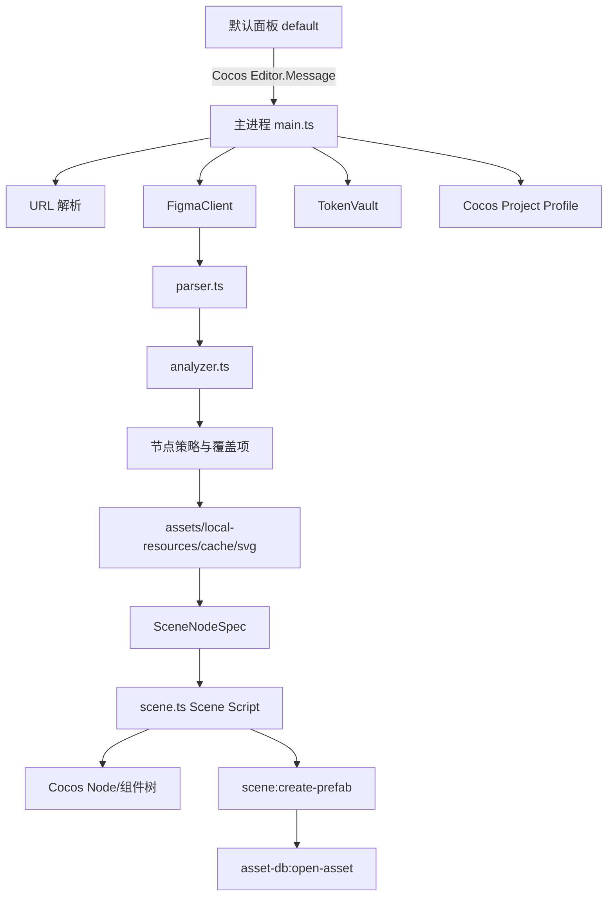

# Figma Importer for Cocos Creator · 技术知识库

> 文档类型：插件架构、实现约束、故障记录与维护手册  
> 适用版本：Cocos Creator 3.8.7  
> 当前插件版本：`1.0.27`
> 当前文档状态：持续维护  
> 最近审计：2026-08-21
> 维护原则：后续每次代码修改前先检查本文档，修改后必须更新“变更记录”“已知问题”和相关实现章节。

## 1. 文档目的

本文档是本插件的长期知识库，不是普通使用说明。它记录：

- 插件的边界、运行环境和 Cocos Creator 约束；
- 从 Figma 链接读取到 Cocos 节点/预制体生成的完整链路；
- 资源、字体、缓存、Token 和配置的生命周期；
- 节点策略与 Cocos 组件映射规则；
- 已修复问题、当前已知限制和回归风险；
- 测试、构建、发布及后续对话的变更记录。

### 1.1 后续对话的强制维护流程

每次后续修改都按以下顺序执行：

1. 读取本文档的“当前实现摘要”“已知问题”和“变更记录”。
2. 检查修改是否违反本文档中的安全、资源路径、预制体生命周期和 Cocos 3.8.7 约束。
3. 修改代码及测试。
4. 执行 `npm test`，必要时在实际 Cocos 项目中验证。
5. 更新本文档中的版本、实现章节、测试状态、已知问题和变更记录。
6. 在提交说明中引用本文档对应的变更条目。

如果实现和本文档冲突，以代码和可复现测试为事实来源；修复代码后必须同步修正文档，不允许长期保留矛盾描述。

## 2. 项目定位与边界

### 2.1 目标

将 Figma 文件或带 `node-id` 的 Frame 链接转换为 Cocos Creator 3.8.7 可使用的 UI 节点、SpriteFrame、字体引用和 Prefab 资源，同时尽可能保留 Figma 的层级、尺寸、布局和视觉效果。

### 2.2 非目标

- 不尝试把任意 Figma 矢量路径转换成 Cocos `cc.Graphics` 路径；矢量视觉节点统一优先走 Figma PNG + Cocos `Sprite`。
- 不把 Token、Figma file key、node id 或解密结果写入项目资源、日志、导出的节点数据或普通缓存文件。
- 不依据 Cocos 当前选中的节点导入。普通文件导入固定从 Canvas 根节点开始；Frame 链接创建独立 Prefab。
- 不自动修改用户当前正在编辑的 Prefab。Prefab 导入的临时场景操作必须回滚，不得自动保存当前 Prefab。

### 2.3 运行约束

| 项目 | 约束 |
|---|---|
| Cocos Creator | `3.8.7`，package engines 为 `>=3.8.7 <3.9.0` |
| 插件类型 | Cocos Creator v2 extension，`package_version: 2` |
| 主进程入口 | `dist/main.js` |
| Scene script | `dist/scene.js` |
| 面板入口 | `dist/panels/default` |
| 语言 | TypeScript，构建目标由 `tsconfig.json` 控制 |
| 测试 | Node.js built-in test runner，`node --test tests/*.test.js` |
| 默认参考画布 | `640 × 1136`，Frame Prefab 居中时使用 |

## 3. 架构总览



### 3.1 进程职责

#### 面板进程：`source/panels/default/index.ts`

- 渲染 UI、节点树、预览、导入设置和进度；
- 保存用户配置；
- 将节点动作覆盖项传给主进程；
- 不读取 Figma Token 明文；
- 不直接访问 Figma API 或 Cocos 场景对象。

#### 扩展主进程：`source/main.ts`

- 管理 Token、Figma API 客户端和当前文档会话；
- 解析 URL、拉取 Figma 文档、执行节点分析；
- 构建图片、SVG、字体和本地资源引用；
- 生成 `SceneNodeSpec`；
- 调用 Scene Script 建树、创建 Prefab、打开资源；
- 向面板发送阶段进度和错误。

#### 场景脚本：`source/scene.ts`

- 在 Cocos scene process 中操作 `cc.Node` 和组件；
- 根据 `SceneNodeSpec` 创建或更新节点；
- 配置 UITransform、Sprite、Label、Layout、Mask、ScrollView 等；
- 执行临时根节点清理和场景撤销边界配合；
- 不负责 Figma 网络请求和 Token 管理。

### 3.2 锚点与坐标转换

- 建树阶段普通节点直接使用 Cocos 默认中心锚点 `(0.5, 0.5)`，不再先创建左上锚点节点再进行二次转换。
- `framePosition` 根据父节点实际锚点、父 UITransform 尺寸、节点尺寸和 Figma Frame 边界直接计算本地中心位置，避免导入后再次遍历和修改节点。
- Graphics 图形直接以节点中心绘制；Sprite、Label、Mask 和 Layout 使用同一套中心锚点坐标。
- ScrollView 的 `view/content` 辅助节点同样使用中心锚点；view 与滚动根节点中心重合，content 在创建业务子节点前先确定最终尺寸，并通过 `((contentWidth - viewWidth) / 2, (viewHeight - contentHeight) / 2)` 保持两者左上边界重合。
- Frame Prefab 根节点使用中心锚点，并在 640×1136 Canvas 参考边界中心放置。

## 4. 目录与模块地图

```text
source/
├─ main.ts                         主进程、导入编排、消息方法
├─ scene.ts                        Cocos 场景脚本、节点/组件构建
├─ types.ts                        Figma、策略、场景规格、设置类型
├─ import-actions.ts               动作归一、终端动作与 Sprite 类型收口
├─ figma/
│  ├─ client.ts                    Figma REST API、重试、取消
│  ├─ parser.ts                    不可信 JSON → 规范化 FigmaNode
│  ├─ analyzer.ts                  节点类型、动作、布局、切片候选分析
│  ├─ slicing.ts                   三宫/九宫格边界识别
│  └─ url.ts                       Figma URL/file key/node id 解析
├─ importer/
│  ├─ assets.ts                    资源写入、同名复用、SpriteFrame UUID
│  ├─ local-resources.ts           本地同名 PNG/SVG 搜索
│  ├─ cache.ts                     哈希键图片缓存
│  ├─ fonts.ts                     项目字体扫描和映射匹配
│  └─ svg.ts                       渐变 SVG/PNG 生成
├─ security/
│  └─ token-vault.ts               Token 加密、会话内存回退
└─ panels/default/
   ├─ index.ts                     默认面板交互逻辑
   └─ model.ts                     可测试的智能动作与选项模型

static/
├─ template/default/index.html     面板结构
└─ style/default/index.css         面板样式

tests/                             单元测试
README.md                          面向使用者的简要说明
FIGMA_IMPORTER_KNOWLEDGE_BASE.md   本知识库（本文档）
```

## 5. 核心数据模型

### 5.1 Figma 数据流

`parser.ts` 将 Figma API 返回值规范化为 `FigmaNode`，避免后续模块直接依赖不稳定的原始 JSON。关键字段包括：

- `id`、`name`、`type`、`visible`；
- `absoluteBoundingBox`、旋转、圆角、约束；
- `fills`、`strokes`、`effects`、透明度；
- `children`、Auto Layout 属性、溢出方向；
- `hasExportSettings`：由原始 `exportSettings` 是否为非空数组派生；
- 文本内容与 `style.fontFamily`。

`parseDocument()` 还建立 `nodeById` 和字体集合，主进程后续按 node id 获取图片和资源。插件只保留“是否人工设置过 Export”这一策略信号，不保留未使用的格式、后缀和尺寸约束元数据。

### 5.2 节点策略类型

`ImportAction`：

| 动作 | 含义 | 是否遍历子节点 |
|---|---|---|
| `generate` | 生成可编辑 Cocos 节点/组件 | 是，容器通常保留层级 |
| `render` | 当前节点及其子树导出为一张 PNG，绑定 Sprite | 否，子树不单独生成 |
| `transform` | 只更新映射节点的几何/可见性 | 按已有节点更新 |
| `ignore` | 忽略当前节点及其整棵子树 | 否 |

`merge` 和 `svg` 不再是当前 `ImportAction`，仅由 `normalizeImportAction()` 作为旧面板热加载兼容值接收，并统一转换为 `render`。面板只展示一个“PNG 整层”，避免两个动作产生相同结果却让用户误以为存在差异。

`NodeKind`：`node`、`sprite`、`label`、`button`、`scrollView`、`layout`、`auto` 等。

### 5.3 SceneNodeSpec

主进程不会把原始 FigmaNode 直接传给 Scene Script，而是生成 `SceneNodeSpec`。它包含：

- 几何：`frame`、`parentFrame`、`rotation`、`cornerRadii`；
- 渲染：`fills`、`strokes`、`opacity`、`sprite`；
- 语义：`action`、`kind`、`figmaType`、`figmaId`；
- 布局：Auto Layout、padding、spacing、alignment、constraints；
- 资源：SpriteFrame UUID、字体 UUID；
- 子节点：递归 `children`。

## 6. 完整导入流程

### 6.1 读取 Figma

1. 面板调用 `fetch-document`。
2. 主进程通过 `parseFigmaSource()` 解析链接：支持 design URL、file URL、原始 file key 和 `node-id`。
3. `FigmaClient` 使用 Token 请求 `/v1/files/:fileKey`，带重试和取消控制。
4. `parseDocument()` 规范化所有页面/根节点，并收集字体。
5. 面板显示节点树、动作策略、警告和图片预览。

### 6.2 节点动作决策

智能默认决策在 `analyzer.ts`，优先级和规则如下。主进程的 `decisionForNode()` 只会对未选择 `ignore` 的 TEXT 与矢量动作再次收紧；隐藏与手动 Export 均是可由用户修改的智能默认策略：

- `TEXT` 除显式 `ignore` 外始终为 `generate`，导入为 Cocos `Label`，不导出文字切图；
- 隐藏节点在智能模式中默认 `ignore`；可见非 `TEXT` 节点只要原始 `exportSettings` 是非空数组，就视为设计者显式指定的资源边界，智能模式默认 `render` 为 PNG 整层并抑制其设计子树；
- 手动 Export 规则同样作用于导入根节点和明确滚动方向的 ScrollView，不受结构化命名自动规则的根节点/ScrollView 保护限制；缺失、空数组或非数组 Export 设置不触发；
- Figma 矢量类型 `VECTOR`、`BOOLEAN_OPERATION`、`STAR`、`LINE`、`REGULAR_POLYGON`、`RECTANGLE`、`ELLIPSE` 始终为 `render`；
- 矢量节点最终为 PNG Sprite，不使用 `cc.Graphics` 近似任意路径；
- 含子节点的 Frame/Group/Component/Instance 默认保留容器层级；
- 智能模式将严格多段 `snake_case` 视为可收口的资源边界：非最外层、非显式 ScrollView 的可见容器，如果至少一个直接可见子层不是同类结构化命名，则当前容器自动 `render` 为 PNG 整层；
- 该规则只检查直接子层，隐藏子层不计入，并通过 `TreeNodeDto.renderSubtree` 让面板保留分析器的终端决策，避免深层噪声导致多个祖先级联压平；
- 面板分别保存“用户/预设希望使用的动作”和“考虑父级终端动作后的有效动作”；每次切换动作都会从根节点重新计算抑制关系。外层 PNG 整层改回“生成”后，内层自动 PNG 边界会恢复，而该内层边界的后代仍保持忽略；
- 图片填充、复杂效果、不支持的渐变/描边等情况走 PNG；
- 可安全表达的 Auto Layout 才映射为 Cocos Layout；
- 智能模式只在 Figma `overflowDirection` 为已知横向、纵向或双向滚动枚举时映射 ScrollView；`NONE`、未知值、节点名称或 `clipsContent` 不会改变组件类型，普通裁剪容器映射 Mask；
- 三宫/九宫候选按子节点名和几何覆盖关系识别，默认不强制开启切片。

面板“智能”预设会对矢量节点强制使用 `render`。面板文案中：

- 矢量节点显示“PNG Sprite”；
- 容器手动整层渲染或命名规则自动收口时显示“PNG 整层”；
- “PNG Sprite”不是父树合并，只代表当前矢量节点自身的 PNG。

### 6.3 资源准备

`buildAssets()` 按节点策略收集 PNG 请求、渐变请求和本地资源命中：

1. 先查最多 3 个本地同名资源目录，顺序为 1 → 2 → 3；
2. 同名命中后复用第一个确定结果，不重复导入；
3. 项目 `assets` 内的资源优先直接解析成 Cocos SpriteFrame；
4. 外部资源或需要独立元数据的资源复制到资源输出目录；
5. 没有本地命中时才调用 Figma Images API；
6. 下载图片写入项目缓存，再由 `AssetWriter` 生成项目资源和 SpriteFrame UUID；
7. 同一项目输出目录下同名节点使用首次导入资源，不在文件名中追加随机 UUID 或倍率后缀。

Figma Export 中的 format（JPG/PNG/SVG/PDF）、suffix 和 constraint（SCALE/WIDTH/HEIGHT）只用于表明设计者人工设置过资源边界。整层资源始终走插件统一的 PNG 路径，下载与缓存继续使用 `ImportSettings.scale`；默认值为 `1`，不会读取或叠加 Figma Export 自带倍率、目标宽度或目标高度。

### 6.4 场景构建

主进程调用 `scene:execute-scene-script` 的 `importDocument()`：

- 普通文件导入：忽略当前 Cocos 选中节点，从 Canvas 根节点开始；无 Canvas 时使用场景根；
- 单 Frame 链接：创建独立根节点，使用最外层 Frame 名称；
- 多根节点文件：创建 `Figma · 文件名` 包装节点，并按横向间隔排列；
- `updateExisting` 仅使用插件保存的 UUID 映射，不读取当前选中节点；
- 增量导入从分层节点切换为 PNG 整层时，会删除旧 `nodeMaps` 中已不再生成的 Figma 子节点；未被插件映射的用户手工子节点会保留并按世界坐标迁移到仍存在的父节点；
- 旧 ScrollView 变为 PNG 整层前，`view/content` 和旧版 `__FigmaContent` 中的子节点会先迁出辅助层；随后只删除旧 Figma 映射节点，避免辅助层销毁时连带删除用户手工节点；
- `view` 直属手工节点以及 `__FigmaBackground` 内手工后代也会在辅助节点销毁前使用 `setParent(..., true)` 迁出，保证延迟销毁阶段不丢节点且世界坐标不变；
- 本轮未重建但仍保留在导入根下的旧映射会合并回新 `nodeMap`，后续恢复该 Figma 节点时复用原 UUID，不会创建重名副本；
- 单根与多根导入之间切换时，会区分“直接 Figma 根”和“合成包装根”，不会把旧根挂到自身；切回单根时清理旧包装与映射兄弟，同时迁出其中未映射的用户节点；
- Scene Script 会独立归一旧 `merge/svg` 动作并收口最终 kind，即使 Cocos 热重载期间主进程与 Scene Script 版本短暂不一致，也不会重新生成空 Layout/ScrollView；
- Cocos 节点名使用 Figma 名称，经过文件系统/节点名安全清理。

### 6.5 Frame Prefab 导入生命周期

Frame 链接的 Prefab 流程是当前最重要的特殊路径：

1. 根据最外层 Frame 名称生成 `db://assets/<prefabFolder>/<frameName>.prefab`；
2. 导入前建立 Cocos 场景撤销边界，保护用户已有未保存修改；
3. 临时根节点仅用于 `scene:create-prefab` 序列化；
4. Prefab 创建成功后立即停用、移除、销毁临时根节点；
5. 清理旧版本 `nodeMaps` 中的遗留根节点；
6. 清空 Cocos 节点选择，避免旧节点被编辑器继续绘制；
7. 调用 `scene:snapshot-abort` 丢弃本次临时导入记录；
8. 不自动保存当前场景/Prefab；
9. 调用 `asset-db:open-asset` 自动打开并选中新 Prefab。

如果用户在导入前本来就有未保存的场景/Prefab 修改，Cocos 仍可能提示保存，这是编辑器保护用户修改的正常行为，不属于插件临时节点污染。

## 7. Cocos 组件映射

| Figma 语义 | Cocos 结果 | 备注 |
|---|---|---|
| Frame/Group/Component/Instance 容器 | `Node` + `UITransform` | 保留子节点层级 |
| 文本 | `Label` | 字体描边使用 Label 内置 outline 属性 |
| PNG/矢量/复杂视觉 | `Sprite` + `SpriteFrame` | 矢量不走 Graphics |
| 简单可表达图形（历史兼容路径） | `Graphics` | 新矢量形状已强制 PNG；仅保留非矢量可编辑降级路径 |
| Button 命名/语义 | `Button` | 根据 `kind` 推断 |
| Auto Layout | `Layout` | 不安全的 Wrap/Grid 保留绝对几何 |
| Clip/Mask | `Mask` | 不给终端 Sprite 误加 Mask |
| Scroll | `ScrollView → view(Mask) → content(Layout)` | 标准 Cocos 结构 |
| Constraints | 不自动添加组件 | 保留绝对几何，Widget 由用户手动配置 |
| 透明度 | `UIOpacity` | 与 Figma opacity 对应 |
| 三宫/九宫 | `Sprite.Type.SLICED` | SpriteFrame 写入边界元数据 |

## 8. 资源、缓存与目录配置

### 8.1 资源输出目录

`assetFolder` 是项目 `assets` 下的相对目录。输出资源直接写入该目录，不再按节点随机追加文件夹。文件名由 Figma 节点名清理得到。

### 8.2 Prefab 输出目录

`prefabFolder` 是项目 `assets` 下的相对目录，可由面板选择并自动创建。Frame Prefab 文件名使用最外层 Frame 名称。

### 8.3 本地同名资源目录

`localResourceFolders` 最多 3 项，可为空。匹配规则：

- 递归扫描 PNG/SVG；
- 文件名与 Figma 节点名规范化匹配；
- 第一个命中目录优先；
- 同目录重复命中按确定性排序取第一个；
- 本地资源仅作为输入素材来源，不等于资源输出目录。

### 8.4 下载缓存

`LocalAssetCache` 使用哈希键构建缓存路径，不使用明文 fileKey、nodeId 或 Token。缓存只保存 PNG/SVG 字节，失败或过期时允许重新下载。

## 9. Token 安全模型

`TokenVault` 是唯一允许接触 Token 明文的模块。

1. 面板调用 `set-token`，Token 进入主进程；
2. 主进程优先使用 Electron `safeStorage`；
3. Windows 使用 DPAPI，macOS 使用系统钥匙串；
4. Linux 检测到 `basic_text` 或不可安全存储时拒绝持久化；
5. 安全存储不可用时仅保留当前编辑器会话内存；
6. 面板只接收 `VaultStatus`，不接收 Token 明文；
7. Token 不进入 Profile、项目文件、资源、普通缓存或日志。

任何新增网络/缓存/日志功能都必须先检查是否可能携带 Token、fileKey、nodeId 或 Authorization header。

## 10. 配置与消息接口

### 10.1 Project Profile

插件使用 Cocos Project Profile 保存：

- `settings`：来源 URL、资源目录、Prefab 目录、本地资源目录、倍率、更新策略、字体映射等；
- `nodeMaps`：Figma file key → Figma node id → Cocos node UUID 的增量更新映射。

Frame Prefab 导入完成后不会保存已销毁临时根节点 UUID；普通场景导入才保留 nodeMaps。

### 10.2 主进程消息

| 消息 | 作用 |
|---|---|
| `open-panel` | 打开面板 |
| `get-state` | 获取 Token 状态、设置、文档、字体 |
| `set-token` / `clear-token` / `verify-token` | Token 生命周期 |
| `save-settings` | 保存导入设置 |
| `pick-asset-folder` | 选择资源输出目录 |
| `pick-prefab-folder` | 选择 Prefab 目录 |
| `pick-local-resource-folder` | 选择本地同名资源目录 |
| `fetch-document` | 读取 Figma 文档 |
| `get-preview` | 获取单节点 PNG 预览 |
| `import-selection` | 启动导入 |
| `cancel-import` | 取消当前导入 |
| `progress` | 面板进度回调 |

### 10.3 Scene Script 方法

| 方法 | 作用 |
|---|---|
| `importDocument` | 按 `SceneImportPayload` 创建/更新 Cocos 节点树 |
| `removeImportedNode` | 停用、脱离父节点并销毁临时/遗留根节点 |

## 11. UI/UX 设计约束

- 面板内部内容不足时必须支持纵向滚动；
- 项目面板字体保持可读尺寸，不用过小字号压缩信息；
- 导入倍率、资源输出目录、Prefab 目录和本地资源目录分组展示；
- 字体映射采用“Figma 字体 → 项目字体”下拉选择，自动匹配后允许手动覆盖；
- 导入按钮显示资源阶段、场景阶段和完成状态；
- Frame Prefab 导入后提示“已创建并打开预制体”；
- 不再显示“导入到当前选中节点”选项；
- 矢量节点在树中显示“PNG Sprite”，避免误解为父层整层合并；
- 子树压平只显示“PNG 整层”，不再提供结果相同的“合并子树”选项；
- PNG 整层节点的类型下拉只显示实际可生成的 `Sprite` / `Button`；切回“生成”时恢复原有 Node/Layout/ScrollView 等类型；
- `ignore` 明确忽略整棵子树；九宫/三宫勾选会在面板有效动作中强制 PNG 并抑制后代，避免界面统计与实际 SceneSpec 不一致；
- 错误提示必须包含可定位的阶段和资源路径，但不能泄露 Token。

## 12. 已知问题与诊断手册

### 12.1 `The plug-in main process failed to load. Cannot find module 'uuid'`

可能原因：Cocos 使用旧版 `dist` 或扩展依赖未安装。处理顺序：

1. 在插件目录执行 `npm install`；
2. 执行 `npm run build`；
3. 完整退出并重启 Cocos Creator；
4. 检查 `package.json` 版本与面板 `runtimeCompatible` 是否一致。

### 12.2 矢量不可见或出现 `cc.Graphics` 冲突

检查：

- 面板动作是否为“PNG Sprite”；
- 输出目录是否生成对应 PNG 和 `.meta`；
- Scene Script 是否为最新 `dist/scene.js`；
- 节点是否同时残留 Sprite 和 Graphics，场景脚本应先移除生成组件；
- Figma Images API 是否返回有效 PNG URL。

### 12.3 导入时提示保存当前 Prefab

正常情况下，Frame Prefab 导入的临时节点会在创建 Prefab 后回滚，不会自动保存当前 Prefab。如果仍提示：

- 检查当前 Prefab 是否在导入前就有未保存修改；
- 完整重启 Cocos 以加载最新插件版本；
- 检查 `scene:snapshot-abort` 是否执行；
- 检查是否仍有旧版扩展目录/旧 `dist` 被 Cocos 加载。

### 12.4 多次导入出现顶层残影

历史原因是临时根节点留在当前场景、节点选择缓存或旧 nodeMap 残留。当前流程应执行停用、脱离父节点、销毁、清空节点选择、撤销临时记录和旧 UUID 清理。若已有旧残影不在 nodeMap 中，需在 Cocos 层级面板删除一次或重新打开场景完成缓存刷新。

### 12.5 资源 URL 超时 `等待 Cocos 资源导入超时`

检查 `db://assets/...` 是否位于项目 `assets` 内、目标目录是否可写、Asset DB 是否完成导入。PNG/SVG 写入后必须等待 Asset DB 返回 UUID，不能直接假设文件已可用。

### 12.6 字体显示为默认字体

字体映射填项目内字体资源的下拉项，不填操作系统绝对路径。插件扫描 `ttf/otf/fnt/woff/woff2`，自动匹配失败时手动选择 `db://assets/...` 字体资源。

### 12.7 导入节点锚点位于左上

旧版本在整个导入树中保留 `(0, 1)` 左上锚点，后续版本仍曾为 ScrollView 自动生成的 `view/content` 单独保留左上锚点。当前版本已统一为 `(0.5, 0.5)`：普通节点根据父节点尺寸直接换算中心位置；滚动节点先计算 content 最终尺寸，再补偿其中心位置以保持左上边界不变。若 Cocos 仍显示左上锚点，先确认扩展已重新构建并重启，且项目加载的是最新 `dist/scene.js`；最新代码中已没有主动写入 `(0, 1)` 的导入路径。

### 12.8 文字节点偏移或高度异常

`Label.Overflow.NONE` 会按实际字体度量重算 UITransform，不能同时把同一 Label 的宽高锁死为 Figma 文本框。Cocos 3.8.7 的 TTF 排版器还会在 `NONE` 下强制设置 `wrapping = false`，因此 `enableWrapText` 不能恢复自动折行。

当前导入标准：

- 先设置文字内容、字号、行高、颜色、描边和映射字体，再调用 `updateRenderData(true)`，只使用最终字体度量做一次位置补偿；
- 所有 Label 最终保持 `Overflow.NONE` 和 `enableWrapText = false`；
- CRLF、CR、U+2028、U+2029 统一转换为 `\n`，只有实际包含 `\n` 才判定为多行；
- 单行使用 `CENTER / CENTER`，实测内容中心锁定 Figma `absoluteBoundingBox` 中心；
- 多行使用 `LEFT / TOP`，实测内容左上角锁定 Figma `absoluteBoundingBox` 左上角；
- `lineHeight` 保留 Figma 的 `lineHeightPx`，不强制提升到 `fontSize`；
- TTF Label 的 UITransform 高度约为 `(显式行数 + 0.26) × lineHeight`（再叠加描边扩展），是 Cocos 的 `BASELINE_RATIO` 度量结果，不代表节点位置发生偏移；BitmapFont 使用另一套度量路径。

Figma 自动折行不会稳定提供每个视觉换行索引。若 `characters` 没有换行符，`NONE` 下无法无风险重现折行；分析面板会提示“请在 Figma 中插入换行符”。为了保证确定性，插件不猜测断行位置，也不伪装开启一个引擎实际忽略的自动换行开关。

### 12.9 字体资源正确但字形仍有差异

位置补偿只能保证 Cocos 实测文字相对 Figma 布局框的中心或左上基准一致。严格字形还原还要求项目字体文件与 Figma 的字体家族、字重和样式一致。当前字体映射以 `fontFamily` 为键，同一家族多个字重需手动选择最合适的项目字体；Cocos 3.8.7 的 TTF/SystemFont 路径不会应用 `Label.spacingX`，Figma `letterSpacing` 只有 BitmapFont 或自定义逐字排版方案才能严格还原。

### 12.10 `Cannot set property view of #<ScrollView> which has only a getter`

Cocos Creator 3.8.7 的 `ScrollView.content` 类型是 `Node`，而 `ScrollView.view` 是只读 getter：引擎通过 `content.parent` 自动取得视口的 `UITransform`。插件不得给 `view` 赋值，也不得把 `content` 的 `UITransform` 传给 `content`。正确建树顺序为 `view.addChild(content)`，再执行 `scroll.content = content`；随后读取 `scroll.view` 应得到 `view` 的 `UITransform`。

### 12.11 带 `list` 名称的普通容器整体偏移半宽/半高

历史智能规则会仅凭 `list_` / `scroll_` 名称把普通 Frame 或 Instance 改造成 ScrollView，再把左上锚点的 view 放在中心锚点父节点的 `(0, 0)`，导致整个子树向右、向下偏移半个视口尺寸。当前规则只接受 Figma 已知的滚动方向枚举；`NONE`、未知值、`clipsContent` 和名称都不会自动改变结构。实际 ScrollView 的 view/content 也已改为中心锚点并保留左上边界，因此手动选择 ScrollView 时不会再次出现同类偏移；增量导入会清除旧误判或旧报错中留下的空 view/content、`__FigmaContent` 辅助层。

### 12.12 结构化资源节点为何自动变成 PNG 整层

智能模式把 `img_hongbao_bg_mini`、`panel_reward_bg` 这类至少包含两个 ASCII 段的严格 `snake_case` 名称视为设计素材边界。当它不是导入根节点，且直接可见子层出现 `Group 91`、`Frame 92`、`Ellipse 5`、中文散名等非结构化名称时，插件在当前边界收口为 PNG 整层。最外层节点、隐藏噪声、没有子层的节点和 Figma 明确声明滚动方向的 ScrollView 不触发；如果每个直接可见子层也都是结构化名称，则继续分层。选择 PNG 整层后，最终 kind 会收口为 Sprite（Button 保留 Button + Sprite），不会生成空 Layout 或 ScrollView。

### 12.13 Figma 手动 Export 为何自动变成 PNG 整层

Figma 节点的 `exportSettings` 为非空数组，表示设计者明确把该节点当作可导出的资源边界。对可见非 `TEXT` 节点，智能模式因此默认选择“PNG 整层”并抑制其设计子树；这条显式意图规则不受结构化命名、是否为导入根节点或是否声明 ScrollView 滚动方向限制。隐藏节点在智能模式中仍默认 `ignore`，文字仍导入为可编辑 `Label`，缺失、空数组或非数组 Export 设置不会触发。

插件不会照搬 Export 条目的输出细节。JPG/PNG/SVG/PDF、文件名后缀以及 SCALE/WIDTH/HEIGHT 约束都只用于确认“人工设置过 Export”；实际资源固定走 PNG，并使用插件导入倍率，默认 `1`。因此 Figma 中的 @2x、固定宽度或固定高度不会导致 Cocos 资源被二次缩放。

### 12.14 Round-trip 开发门禁

导出端 handoff、manifest 与 golden fixtures 已镜像并逐文件校验。Round-trip 现为独立 production 路径：完整文件 REST 读取强制 `plugin_data=shared`，严格解析 managed root/header/chunks/node/resource metadata/visualManifest，生成 Canonical F；再以 Prefab UUID 经 AssetDB 定位原资产，按稳定 node/component fileId 生成 Canonical C，最后执行五类 scalar leaf 的 B/F/C Diff3。

P0 Writer 选择 Raw Prefab Copy-on-write，只修改 `_lpos.x/y`、`UITransform._contentSize.width/height`、经 PaintProjection 与 AssetDB 双重证明的 `_spriteFrame.__uuid__`。事务包含 opaque one-use token、Figma version/Prefab/meta/ledger generation 二次校验、排他锁、exact backup、prepare journal、原子 replace、reimport、semantic preserve post-audit、字段级 baseline 推进、receipt 与失败 rollback。启动恢复只清理 owner bytes 完全匹配且 PID 已不存在的 stale lock。

面板中的 Round-trip 区域与旧导入按钮分离；首次 Pair 只建立 genesis ledger，不改 Prefab。`.cocos-figma-sync` 位于项目根且不进入 AssetDB，插件不自动修改用户 `.gitignore`。当前代码级实现候选已完成；真实 Creator 3.8.7/Figma Desktop 证据未归档前仍不能标记 G2。

## 13. 测试与质量门禁

标准命令：

```bash
npm run build
npm test
```

`npm test` 会先构建 TypeScript，再运行 `tests/*.test.js`。当前覆盖：

- Figma URL 和 node id 解析；
- 多页面文档解析和缺失边界保护；
- 节点动作、矢量/基础形状 PNG 策略和安全 Layout 降级；
- 结构化命名识别、非根混乱子树 PNG 收口、旧 merge/svg 动作归一和面板选项；
- Figma Export 标记解析、显式 PNG 整层边界、根节点/ScrollView 生效以及 hidden/TEXT/空 Export 优先级；
- 嵌套 PNG 边界的动作恢复与后代抑制重算；
- 三宫/九宫候选与真实边界；
- PNG/SVG、渐变和本地同名资源；
- 字体匹配；
- Cocos Sprite/Mask/ScrollView/Prefab 根布局；
- 普通节点与 ScrollView 辅助节点的中心锚点、内容扩容和坐标补偿；
- 增量导入时 Mask/Graphics、Label/LabelOutline 的延迟销毁生命周期；
- 分层节点改为 PNG 整层时的旧映射子节点清理与手工子节点保留；
- 旧 ScrollView 直接改为 PNG 整层时的辅助层清理、手工节点迁移和旧 SceneSpec 兼容；
- 保留映射回填、节点恢复不重复、单根/多根双向切换及失败回滚；
- Token 加密和明文不落盘；
- 缓存哈希键不泄露 fileKey/nodeId；
- Round-trip 协议 hash/canonical/Geometry、Shared Data reader、Cocos identity reader、Diff3、ledger、事务、资源 proof、精确回滚与启动恢复。

当前基线：`104` 项测试通过（截至 2026-08-21）。其中原有 `68` 项单向导入回归保持通过，新增 `36` 项覆盖 Round-trip 协议、读取、Creator fixture、Diff3、ledger、事务与恢复。

## 14. 发布与版本策略

1. 修改 `source`、`static` 或测试；
2. 更新 `package.json` 与 `package-lock.json` 版本；
3. `npm test`；
4. 在实际 Cocos Creator 3.8.7 项目重启插件验证；
5. 更新本文档的变更记录；
6. 提交中文变更说明，并将同一个 `main` 提交推送到两个指定 Git 远端；两个远端都成功才算发布完成。

版本递增原因：Cocos 可能继续加载旧主进程；版本变化可让面板检测到主进程/面板不一致并提示重启。

### 14.1 双远端推送规则

- 后续用户要求“推送”“传 Git”或发布时，必须把同一个提交分别推送到两个指定 Git 地址，不得只推一个远端后宣称完成；
- 远端地址与凭据仅保存在本地 Git 配置中，不得写入项目源码、测试、README 或知识库；
- 推送前读取本地远端配置，向两个已配置远端推送后分别验证目标分支均已接收同一提交。

## 15. 设计决策记录

| 决策 | 原因 | 当前结论 |
|---|---|---|
| Token 不写明文 | 避免项目、日志和缓存泄露 | `TokenVault` + safeStorage/会话内存 |
| 文本不导出切图 | 保留 Label 可编辑性 | TEXT 始终 `generate` |
| 矢量不使用 Graphics | 任意 Figma 路径无法被简单 Graphics 准确表达 | 矢量/基础形状 PNG + Sprite |
| Frame 链接生成 Prefab | 用户希望复制链接即得到独立 Prefab | 最外层 Frame 为根，自动打开 |
| 不读取 Cocos 选中节点 | 避免导入到错误场景/Prefab或产生残影 | 普通导入固定 Canvas 根 |
| 同名资源复用首个命中 | 避免后缀泛滥和重复资源 | 确定性查找，不追加随机名 |
| ScrollView 使用标准三层结构 | 与 Cocos 常用结构兼容 | ScrollView → view → content，三层均为中心锚点 |
| ScrollView 智能识别只接受已知滚动枚举 | 名称、裁剪和未知属性不代表交互滚动，误判会改写层级和坐标 | 横向、纵向或双向滚动枚举才自动映射；其余可手动选择 |
| 混乱设计层在最近的结构化边界收口 | 自动生成的 Group/Frame/形状层通常没有运行时编辑价值，继续分层会制造大量噪声 | 非根严格 snake_case 容器遇到未结构化直接可见子层时使用 PNG 整层；显式 ScrollView 除外 |
| Figma 手动 Export 作为显式资源边界 | 设计者已明确声明节点应整体输出，继续拆分会违背设计语义 | 可见非 TEXT 节点默认 PNG 整层，根节点和显式 ScrollView 也生效；格式、后缀和尺寸约束不改变插件 PNG/倍率策略 |
| 只保留一个 PNG 整层动作 | `merge` 与容器 `render` 的请求、缓存、资源和 Scene 结果完全相同 | 面板删除“合并子树”；旧 `merge/svg` 输入兼容归一为 `render` |
| 不自动导入 Widget | 避免 Constraints 适配组件改变已还原的绝对位置 | 导入后由用户在 Cocos 中手动配置 |
| 不安全 Auto Layout 降级绝对布局 | 防止 Layout 重排破坏视觉 | 保留 Node + 几何位置 |
| Round-trip 使用 Raw Prefab Copy-on-write | 需要逐字段 patch，同时机器化证明脚本、未知组件和结构保持不变 | 完整 pre/post/rollback projection；仅 Creator 3.8.7 可 Apply，真机证据完成前不称 G2 |

## 16. 变更记录

记录格式：`日期 · 版本/提交 · 变更 · 验证 · 影响/迁移说明`。

### 2026-08-21 · Round-trip T01–T10 实现候选（开发分支，未发布）

- 镜像 exporter 协议/Schema/fixtures，加入逐文件 SHA-256、canonical JSON、Unicode chunk、Geometry v1 与 1,000 组正逆向量门禁。
- 新增 Figma Shared Data reader/projector、Prefab UUID/fileId/component reader、五 leaf Diff3、独立 dry-run/Pair/Apply 面板与消息。
- 新增项目根 ledger/baseline/lock/journal/backup/receipt、one-use token、Raw Prefab 白名单 Writer、SpriteFrame/paint proof、semantic audit、rollback 和 dead-owner 启动恢复。
- reimport 故障注入证明 exact-byte rollback 且 ledger 不前进；ledger commit 后进程中断会补全 committed receipt，不会误回滚；Creator 非 3.8.7 或目标 Prefab 已被编辑器加载时在写前阻断。
- Round-trip 使用独立取消控制器，preview txnId 与最终 receipt 一致，同一已消费 Apply token 只返回既有结果。
- 隔离 Creator 3.8.7 工程已证明扩展启用、fixture 迁移/导入、AssetDB UUID API 唯一定位，以及 position/contentSize 的真实 raw write → reimport → post-audit → ledger/receipt commit；证据见 `docs/evidence/creator387-isolated-probe.md`。
- 全量 `npm test` 为 104/104；完整 Creator/Figma 外部证据尚待完成，因此当前状态为实现候选而非最终 G2。

### 2026-08-20 · `1.0.27`

- 从 Figma 原始 `exportSettings` 派生手动 Export 标记；可见非文字节点只要 Export 数组非空，智能模式即默认 PNG 整层并抑制设计子树。
- 手动 Export 作为显式意图可作用于导入根节点和明确滚动方向的 ScrollView；隐藏节点仍在智能模式中默认忽略，文字仍为可编辑 Label，空或非数组 Export 不触发。
- Export 格式、后缀和 SCALE/WIDTH/HEIGHT 约束不进入插件数据模型；实际资源固定走 PNG，并使用插件导入倍率（默认 `1`）。
- 补充解析、节点策略及边界优先级回归测试；`68` 项测试通过。
- 记录双远端发布要求：未来同一提交必须推送到两个 Git 地址，全部成功后才可报告推送完成。
- 删除项目文档中的远端地址；远端信息仅由本地 Git 配置维护。

### 2026-08-10 · 知识库初始化

- 新增本文档，覆盖架构、数据流、安全、资源、Prefab 生命周期、测试和故障处理。
- 建立“后续对话先检查、修改后记录”的维护规则。

### 2026-08-10 · `1.0.15` / `4454b20`

- 加强多次 Prefab 导入残影清理：临时根节点先停用，再移除和销毁。
- 清空 `create-prefab` 可能留下的节点选择状态。
- 保留 `snapshot-abort` 撤销边界，避免当前 Prefab 被插件临时操作标记为脏。
- 27 项测试通过。

### 2026-08-10 · `1.0.16`

- 普通导入节点改为最终使用 Cocos 默认中心锚点 `(0.5, 0.5)`。
- 改为整棵节点树构建完成后统一切换锚点，并按 Figma Frame 边界补偿位置，避免父子节点在导入过程中发生偏移。
- Graphics 图形同步从左上绘制坐标改为中心绘制坐标；ScrollView `view/content` 保留左上锚点。
- 新增中心锚点与子节点位置回归测试；28 项测试通过。

### 2026-08-10 · `1.0.17`

- 将中心锚点计算从导入完成后的归一化阶段前移到建树阶段。
- 普通节点创建时直接设置 `(0.5, 0.5)`，按父节点锚点和实际尺寸计算中心位置，移除二次遍历与 Graphics 重绘。
- 保留 ScrollView `view/content` 的左上锚点，并补充嵌套节点位置回归测试。
- 29 项测试通过。

### 2026-08-10 · `1.0.18`

- 面板顶部移除装饰图标。
- 移除顶部 Cocos Creator 版本号文案，标题区域改为简洁的两列布局。
- 保留插件标题、副标题和连接状态显示；构建后需重启面板加载新模板。

### 2026-08-11 · `1.0.19`

- 停止根据 Figma Constraints 自动创建 `cc.Widget`。
- 保留节点的中心锚点、尺寸和绝对位置，避免 Widget 适配逻辑覆盖导入结果。
- 新增 Constraints 场景回归测试；30 项测试通过。

### 2026-08-11 · `1.0.20`

- 字体描边改用 Cocos 3.8.7 `Label.enableOutline`、`outlineColor`、`outlineWidth`，不再创建 `LabelOutline`。
- 修复 Label 设置字符串/字体后 UITransform 被重新计算导致的文字偏移和高度异常：恢复 Figma Frame 尺寸，并保留原始行高。
- 新增文字描边、文字框尺寸和位置回归测试；31 项测试通过。

### 2026-08-11 · `1.0.21`

- 修复 Cocos `Label.Overflow.NONE/RESIZE_HEIGHT` 根据字体度量自动扩展文字框的问题。
- 导入文字统一使用 `CLAMP` 保持 Figma 已提供的文本框尺寸，避免 17px 被重新扩展为约 21.34px 并造成中心锚点偏移。
- 增加溢出模式回归断言；31 项测试通过。

### 2026-08-11 · `1.0.22`

- 按用户标准恢复所有文字为 `Label.Overflow.NONE`。
- 初步实现单行水平/竖直居中及多行左上对齐。
- Figma 文本框改为对齐参考框：单行保持中心，多行在字体测量后补偿左上位置，避免 NONE 自动尺寸改变布局基准。
- 新增单行与多行对齐回归测试；32 项测试通过。

### 2026-08-11 · `1.0.23`

- 按 Cocos Creator 3.8.7 引擎实际语义修正 `NONE` 文本策略：移除无效的自动换行设置，所有 Label 明确使用 `enableWrapText = false`。
- 仅把显式换行文本判定为多行，规范化 CRLF/CR/U+2028/U+2029；不再通过文本框高度或 `maxLines` 猜测多行。
- 单行最终度量中心锁定 Figma 布局框中心；显式多行最终度量左上锁定 Figma 布局框左上。
- 多行补偿在节点局部坐标中计算并按节点角度旋转，旋转文字同样保持原局部左上基准。
- 对疑似 Figma 自动折行但没有显式换行的文本增加分析警告，避免静默产生错误布局。
- 测试替身按 3.8.7 的 NONE 尺寸重算、基线扩展和描边扩展建模；新增自动折行警告、换行规范化、误判、映射字体最终度量和旋转补偿回归测试，36 项测试通过。

### 2026-08-11 · `1.0.24`

- 修复 ScrollView 标准结构的组件引用：`scroll.content` 改为绑定 content 节点，不再错误传入 `UITransform`。
- 删除对只读 `scroll.view` 的赋值，由 Cocos 3.8.7 根据 `content.parent` 自动解析 view。
- 测试替身加入与 3.8.7 一致的 content 类型检查和只读 view getter，原有 ScrollView 层级测试扩展为组件引用回归测试；36 项测试通过。

### 2026-08-11 · `1.0.25`

- 修复普通 `panel_list` / `list_tabs` 等节点仅因名称被误判为 ScrollView，导致子树整体偏移的问题；智能识别现只使用 Figma 明确的滚动溢出属性。
- ScrollView 自动生成的 view/content 改用中心锚点，content 在子节点创建前预计算最终尺寸并补偿位置，保证可见区域与 Figma 坐标完全一致。
- 单轴滚动只扩展对应内容轴，裁剪但不滚动的容器继续使用普通 Node/Layout + Mask。
- 增量导入时若节点从旧版误判 ScrollView 恢复为普通容器，会自动移除遗留 view/content 并把业务子节点恢复到正确父层级。
- 重复导入仍有有效 Auto Layout 时直接复用 content 的 Layout，取消布局时才移除，避免 Cocos 延迟销毁让新布局在帧末一起消失；双轴滚动用 content 实际尺寸换算局部坐标，但 CENTER/MAX/STRETCH 的布局可用区仍以 Figma 视口尺寸为准，避免扩容改变设计对齐。
- 增量导入会复用本轮仍需要的 Layout、Mask、ScrollView 和渲染组件；切换互斥渲染组件时等待 Cocos 完成延迟销毁后再创建，避免同一帧删除/重建导致组件冲突或帧末消失。
- 清理旧版 `LabelOutline` 时先等待其 `onDisable()` 完成，再配置 Label 内置描边或切换渲染器；取消 Mask 但继续使用 Graphics 时重建 Graphics，避免 Mask 的延迟 `onDisable()` 在帧末把新画面禁用。
- 复用 Label 时显式重置默认字体、白色和描边状态，防止增量导入继承上一次的组件属性。
- 滚动方向按已知枚举、忽略大小写解析，未知值不会触发智能 ScrollView；手动 ScrollView 的未知方向安全回退为纵向。
- 新增真实列表命名、中心锚点、大内容坐标合成、横纵单轴边界、Layout 对齐与变化、结构组件复用、延迟销毁渲染切换、异常方向、旧辅助节点清理及旧组件迁移回归测试；51 项测试通过。

### 2026-08-14 · `1.0.26`

- 新增严格多段 `snake_case` 资源边界识别：非最外层容器只要存在未结构化的直接可见子层，智能模式就在最近边界自动设置 PNG 整层；隐藏噪声和显式 ScrollView 不触发。
- 删除面板“合并子树”，三/九 Rectangle 自动收口改用 `render`；旧 `merge/svg` 请求仍在主进程入口兼容归一为 PNG 整层。
- 面板模型新增可测试的智能动作、动作选项和终端抑制重算；RECTANGLE、ELLIPSE 与其他矢量类型统一显示“PNG Sprite”，PNG 整层只显示实际有效的 Sprite/Button 类型。
- `ignore` 统一为忽略整棵子树；九宫/三宫选择参与有效动作重算；Auto 按钮在 PNG 模式下与主进程一致显示 Button + Sprite。
- PNG 整层的最终节点类型强制收口为 Sprite，Button 保留 Button + Sprite，不再生成空 Layout/ScrollView。
- 增量导入从分层或旧 ScrollView 切换为 PNG 整层时自动清理旧映射子树，同时迁移并保留用户手工添加的未映射子节点；保留映射会继续写回，Scene Script 同时增加旧动作的独立防御性归一。
- 修复单根/多根双向切换、自父循环、旧包装残留和失败导入回滚；迁移 `view` 直属节点及背景辅助层手工后代时保持世界坐标。
- 新增命名边界、根节点保护、隐藏噪声、隐藏三/九宫、ScrollView 保护、嵌套终端抑制、旧动作兼容、面板选项、根模式切换和增量清理回归测试；66 项测试通过。

### `1.0.14` / `2f92870`

- Figma `RECTANGLE`、`ELLIPSE` 等基础形状加入矢量 PNG 路径。
- 智能模式强制矢量节点使用 `render`，避免 `cc.Graphics`。
- Frame Prefab 导入使用撤销边界，跳过当前 Prefab 自动保存。

### `1.0.13` / `5d012eb`

- 面板将矢量节点的 `render` 动作显示为“PNG Sprite”，与容器“PNG 整层”区分。

### `1.0.12` / `0103c0e`

- 删除“导入到当前选中节点”设置和逻辑。
- 普通导入固定从 Canvas 根节点开始。

### `1.0.11` / `1e54ef4`

- Frame 链接导入创建 Prefab 后自动打开并选中资源。
- 销毁临时根节点并清理旧导入根，修复顶层残影的主要来源。

### `1.0.10` 之前的关键变更

- `3bb9a23`：Prefab 使用最外层 Frame 名称命名。
- `95e2d6b`：修复矢量节点误用 Graphics。
- `8b412c7`：文字不导出切图、母节点同名资源复用。
- `94723e7`：支持最多三个本地同名资源目录。
- `34c9e26`：支持 Prefab 目录和可视化字体映射。
- `08522b7`：支持 Frame Prefab 根节点居中到 640×1136 Canvas。

## 17. 后续变更记录模板

复制以下模板追加到“变更记录”顶部：

```markdown
### YYYY-MM-DD · `版本` / `提交`

- 变更：
- 原因：
- 影响模块：
- 验证命令/结果：
- Cocos 实机验证：
- 已知限制或迁移说明：
```

## 18. 当前审计结论

- 架构边界清晰：面板、主进程、场景脚本职责分离。
- Token 安全策略满足“不以明文存在”的要求。
- Frame Prefab 命名、根节点 UITransform、Canvas 居中和自动打开已形成完整流程。
- 普通导入不读取当前选中节点，减少误导入和残影风险。
- 矢量与基础形状默认 PNG Sprite，不依赖 `cc.Graphics`。
- 智能模式可在最近的结构化资源边界自动收口混乱设计子层，且不会压平最外层或显式 ScrollView。
- Figma 手动 Export 已形成更高优先级的显式资源边界：可见非文字节点自动 PNG 整层，根节点和显式 ScrollView 同样生效；隐藏、文字与空 Export 的边界行为明确。
- Figma Export 的格式、后缀及尺寸约束不会改变插件输出：整层资源固定 PNG，倍率继续由插件设置控制并默认 `1`。
- 子树压平对用户仅暴露“PNG 整层”，旧动作值在入口兼容归一。
- 资源、缓存、字体、三/九宫和滚动节点均有明确实现入口和测试覆盖。
- 仍需在真实 Cocos Creator 3.8.7 中持续回归：连续导入、当前 Prefab 已有未保存修改、Asset DB 慢导入、旧版本残留场景缓存。
