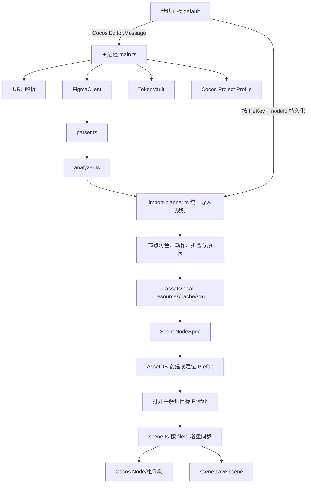

# Figma Importer for Cocos Creator · 技术知识库

> 文档类型：插件架构、实现约束、故障记录与维护手册  
> 适用版本：Cocos Creator 3.8.7  
> 当前插件版本：`1.0.37`
> 当前文档状态：持续维护  
> 最近审计：2026-08-27
> 维护原则：后续每次代码修改前先检查本文档，修改后必须更新“变更记录”“已知问题”和相关实现章节。

## 1. 文档目的

本文档是本插件的长期知识库，不是普通使用说明。它记录：

- 插件的边界、运行环境和 Cocos Creator 约束；
- 从 Figma 链接读取到 Cocos 节点/预制体生成的完整链路；
- 资源、字体、缓存、Token 和配置的生命周期；
- 节点策略与 Cocos 组件映射规则；
- 已修复问题、当前已知限制和回归风险；
- 测试、构建、发布及后续对话的变更记录。

### 1.1 后续对话的强制维护流程

每次后续修改都按以下顺序执行：

1. 读取本文档的“当前实现摘要”“已知问题”和“变更记录”。
2. 检查修改是否违反本文档中的安全、资源路径、预制体生命周期和 Cocos 3.8.7 约束。
3. 修改代码及测试。
4. 执行 `npm test`，必要时在实际 Cocos 项目中验证。
5. 更新本文档中的版本、实现章节、测试状态、已知问题和变更记录。
6. 在提交说明中引用本文档对应的变更条目。

如果实现和本文档冲突，以代码和可复现测试为事实来源；修复代码后必须同步修正文档，不允许长期保留矛盾描述。

## 2. 项目定位与边界

### 2.1 目标

将 Figma 文件或带 `node-id` 的 Frame 链接转换为 Cocos Creator 3.8.7 可使用的 UI 节点、SpriteFrame、字体引用和 Prefab 资源，同时尽可能保留 Figma 的层级、尺寸、布局和视觉效果。

### 2.2 非目标

- 不尝试把任意 Figma 矢量路径转换成 Cocos `cc.Graphics` 路径；矢量视觉节点统一优先走 Figma PNG + Cocos `Sprite`。
- 不把 Token、Figma file key、node id 或解密结果写入项目资源、日志、导出的节点数据或普通缓存文件。
- 不依据 Cocos 当前选中的节点导入。普通文件导入固定从 Canvas 根节点开始；Frame 链接创建独立 Prefab。
- Frame 链接只允许修改其来源绑定的目标 Prefab；必须先打开并验证该 Prefab，绝不把节点临时挂入导入前的场景或其他 Prefab。目标 Prefab 有未保存修改时先阻断。

### 2.3 运行约束

| 项目 | 约束 |
|---|---|
| Cocos Creator | `3.8.7`，package engines 为 `>=3.8.7 <3.9.0` |
| 插件类型 | Cocos Creator v2 extension，`package_version: 2` |
| 主进程入口 | `dist/main.js` |
| Scene script | `dist/scene.js` |
| 面板入口 | `dist/panels/default` |
| 语言 | TypeScript，构建目标由 `tsconfig.json` 控制 |
| 测试 | Node.js built-in test runner，`node --test tests/*.test.js` |
| 默认参考画布 | `640 × 1136`，Frame Prefab 居中时使用 |

## 3. 架构总览



### 3.1 进程职责

#### 面板进程：`source/panels/default/index.ts`

- 渲染 UI、节点树、策略原因/警告、预览、导入设置和进度；
- 保存用户配置；
- 将节点动作、Cocos 类型和九宫选项的显式覆盖项传给主进程；
- 不读取 Figma Token 明文；
- 不直接访问 Figma API 或 Cocos 场景对象。

#### 扩展主进程：`source/main.ts`

- 管理 Token、Figma API 客户端和当前文档会话；
- 解析 URL、拉取 Figma 文档、执行节点分析和统一导入规划；
- 按 Figma `fileKey + nodeId` 读取、校验并持久化节点覆盖项；
- 构建图片、SVG、字体和本地资源引用；
- 生成 `SceneNodeSpec`；
- 通过 AssetDB 创建或定位并打开目标 Prefab，再调用 Scene Script 原地增量建树；
- 向面板发送阶段进度和错误。

#### 场景脚本：`source/scene.ts`

- 在 Cocos scene process 中操作 `cc.Node` 和组件；
- 根据 `SceneNodeSpec` 创建或更新节点；
- 配置 UITransform、Sprite、Label、Layout、Mask、ScrollView 等；
- 校验 Prefab 编辑模式、目标 UUID 和根 fileId，按所有权清理旧受管节点；
- 不负责 Figma 网络请求和 Token 管理。

### 3.2 锚点与坐标转换

- 建树阶段普通节点直接使用 Cocos 默认中心锚点 `(0.5, 0.5)`，不再先创建左上锚点节点再进行二次转换。
- `framePosition` 根据父节点实际锚点、父 UITransform 尺寸、节点尺寸和 Figma Frame 边界直接计算本地中心位置，避免导入后再次遍历和修改节点。
- Graphics 图形直接以节点中心绘制；Sprite、Label、Mask 和 Layout 使用同一套中心锚点坐标。
- ScrollView 的 `view/content` 辅助节点同样使用中心锚点；view 与滚动根节点中心重合，content 在创建业务子节点前先确定最终尺寸，并通过 `((contentWidth - viewWidth) / 2, (viewHeight - contentHeight) / 2)` 保持两者左上边界重合。
- Frame Prefab 根节点使用中心锚点和本地位置 `(0, 0)`；实例放入中心锚点的 640×1136 Canvas 时即位于参考边界中心。

## 4. 目录与模块地图

```text
source/
├─ main.ts                         主进程、导入编排、消息方法
├─ scene.ts                        Cocos 场景脚本、节点/组件构建
├─ types.ts                        Figma、策略、场景规格、设置类型
├─ import-actions.ts               动作归一、终端动作与 Sprite 类型收口
├─ figma/
│  ├─ client.ts                    Figma REST API、重试、取消
│  ├─ parser.ts                    不可信 JSON → 规范化 FigmaNode
│  ├─ analyzer.ts                  节点类型、动作、布局、切片候选分析
│  ├─ import-planner.ts             语义角色、视觉折叠、原因与统一导入计划
│  ├─ slicing.ts                   三宫/九宫格边界识别
│  └─ url.ts                       Figma URL/file key/node id 解析
├─ importer/
│  ├─ assets.ts                    资源写入、同名复用、SpriteFrame UUID
│  ├─ local-resources.ts           本地同名 PNG/SVG 搜索
│  ├─ cache.ts                     哈希键图片缓存
│  ├─ fonts.ts                     项目字体扫描和映射匹配
│  └─ svg.ts                       渐变 SVG/PNG 生成
├─ security/
│  └─ token-vault.ts               Token 加密、会话内存回退
└─ panels/default/
   ├─ index.ts                     默认面板交互逻辑
   └─ model.ts                     可测试的智能动作与选项模型

static/
├─ template/default/index.html     面板结构
└─ style/default/index.css         面板样式

tests/                             单元测试
README.md                          面向使用者的简要说明
FIGMA_IMPORTER_KNOWLEDGE_BASE.md   本知识库（本文档）
```

## 5. 核心数据模型

### 5.1 Figma 数据流

`parser.ts` 将 Figma API 返回值规范化为 `FigmaNode`，避免后续模块直接依赖不稳定的原始 JSON。关键字段包括：

- `id`、`name`、`type`、`visible`；
- `absoluteBoundingBox`、旋转、圆角、约束；
- `fills`、`strokes`、`effects`、透明度；
- `children`、Auto Layout 属性、溢出方向；
- `hasExportSettings`：由原始 `exportSettings` 是否为非空数组派生；
- 文本内容与 `style.fontFamily`。

`parseDocument()` 还建立 `nodeById` 和字体集合，主进程后续按 node id 获取图片和资源。插件只保留“是否人工设置过 Export”这一策略信号，不保留未使用的格式、后缀和尺寸约束元数据。几何方面同时保留 `absoluteBoundingBox`、`size` 与 `relativeTransform`：前者是页面坐标中的旋转后轴对齐包围盒，后两者分别代表未旋转本地尺寸和父级局部仿射矩阵。

### 5.2 节点策略类型

`ImportAction`：

| 动作 | 含义 | 是否遍历子节点 |
|---|---|---|
| `generate` | 生成可编辑 Cocos 节点/组件 | 是，容器通常保留层级 |
| `render` | 当前节点及其子树导出为一张 PNG，绑定 Sprite | 否，子树不单独生成 |
| `transform` | 只更新映射节点的几何/可见性 | 按已有节点更新 |
| `ignore` | 忽略当前节点及其整棵子树 | 否 |

`merge` 和 `svg` 不再是当前 `ImportAction`，仅由 `normalizeImportAction()` 作为旧面板热加载兼容值接收，并统一转换为 `render`。面板只展示一个“PNG 整层”，避免两个动作产生相同结果却让用户误以为存在差异。

`NodeKind`：`node`、`sprite`、`label`、`richText`、`button`、`scrollView`、`layout`、`auto` 等。

`import-planner.ts` 是节点最终策略的统一规划层。它使用 `NodeSemanticRole` 将节点归类为 `root`、`panel`、`list`、`layout`、`button`、`image`、`text`、`view`、`content` 或 `unknown`，并为每个节点生成 `NodeImportPlan`：

- `reason`：说明节点为什么保留结构、转 PNG、折叠或采用用户覆盖；
- `kind`：折叠或语义识别后的最终 Cocos 类型；
- `fold`：单图片、单文字或背景提升计划；
- `absorbedNodeIds`：被父节点吸收、但仍需参与增量追踪的全部 Figma 节点 ID。

规划器是面板说明、资源准备和 `SceneNodeSpec` 的共同事实来源，避免三个阶段各自重复推断。用户显式覆盖的优先级高于自动折叠，规划器不会悄悄改回默认结果。

节点名覆盖是独立于导入策略的可选项：面板节点树中的名称可直接编辑，按 `fileKey + nodeId` 恢复；它只修改最终 Cocos `Node.name`，不会改变 Figma 原名、语义角色、资源同名匹配或动作/类型的 `explicit` 状态。改名后的子节点会被视为必须保留的结构边界，自动折叠和本地同名母节点提升不得把它吸收掉。输入统一经过 `sanitizeNodeName()`，过滤控制字符和路径分隔符、压缩空白并限制为 96 个字符。

### 5.3 SceneNodeSpec

主进程不会把原始 FigmaNode 直接传给 Scene Script，而是生成 `SceneNodeSpec`。它包含：

- 几何：`frame`（页面轴对齐包围盒）、`intrinsicSize`（未旋转本地尺寸）、`relativeTransform`（父级局部矩阵）、已转为度数的 `rotation`、`parentFrame`、`cornerRadii`；
- 渲染：`fills`、`strokes`、`opacity`、`sprite`；
- 语义：`action`、`kind`、最终 Cocos `name`、`figmaType`、`figmaId`、`planReason`；
- 布局：Auto Layout、padding、spacing、alignment、constraints；
- 资源：SpriteFrame UUID、字体 UUID；
- 增量映射：普通场景用运行时 UUID；Frame Prefab 用持久 `PrefabInfo.fileId`。`aliasFigmaIds` 可将折叠来源映射到同一节点，`flattenBoundary` 明确清理边界；
- 子节点：递归 `children`。

## 6. 完整导入流程

### 6.1 读取 Figma

1. 面板调用 `fetch-document`。
2. 主进程通过 `parseFigmaSource()` 解析链接：支持 design URL、file URL、原始 file key 和 `node-id`。
3. `FigmaClient` 使用 Token 请求 `/v1/files/:fileKey`，带重试和取消控制。
4. `parseDocument()` 规范化所有页面/根节点，并收集字体。
5. 面板显示节点树、动作策略、警告和图片预览；节点名输入框支持回车/失焦保存、Esc 放弃，改名项以强调色标识，搜索同时匹配修改名与 Figma 原名。

### 6.2 节点动作决策

智能默认决策在 `analyzer.ts`，优先级和规则如下。主进程的 `decisionForNode()` 只会对未选择 `ignore` 的 TEXT 与矢量动作再次收紧；隐藏状态与节点导入策略相互独立：

- `TEXT` 除显式 `ignore` 外始终为 `generate`，导入为 Cocos `Label`，不导出文字切图；
- Figma 隐藏节点与可见节点使用相同的文字、矢量、容器、Export、三/九宫、本地资源和 PNG 决策；节点及其可生成子树照常进入 SceneSpec，Cocos 仅把该节点自身设置为 `active=false`（Inactive）；
- 隐藏父节点默认保留完整子树，子节点各自保留 Figma 可见性。可见父节点不会自动折叠或通过同名母资源提升吞掉隐藏后代，避免丢失可独立启用的 Inactive 状态边界；显式 `ignore` 和显式 PNG 整层仍按用户选择阻断后代；
- 非 `TEXT` 节点只要原始 `exportSettings` 是非空数组，就视为设计者显式指定的资源边界，智能模式默认 `render` 为 PNG 整层并抑制其设计子树；隐藏状态不取消该 Export 规则；
- 手动 Export 规则同样作用于导入根节点和明确滚动方向的 ScrollView，不受结构化命名自动规则的根节点/ScrollView 保护限制；缺失、空数组或非数组 Export 设置不触发；
- Figma 矢量类型 `VECTOR`、`BOOLEAN_OPERATION`、`STAR`、`LINE`、`REGULAR_POLYGON`、`RECTANGLE`、`ELLIPSE` 始终为 `render`；
- 矢量节点最终为 PNG Sprite，不使用 `cc.Graphics` 近似任意路径；
- 含子节点的 Frame/Group/Component/Instance 默认保留容器层级；
- 智能模式将严格多段 `snake_case` 视为潜在资源边界，但只有其所有“有效可见”直接子层均为非结构化命名、子树中不存在 TEXT、结构化名称、运行时语义、显式滚动/Layout、手动 Export 或三/九宫边界，并且子树确实含有视觉内容时，才自动 `render` 为 PNG 整层；
- “有效可见”会排除隐藏、完全透明和零面积子层。规则由过去的“任意一个非结构化子层即收口”改为保守的“全为非结构化纯视觉子树才收口”，因此 `panel_view` 这类结构化与临时设计层混合的容器会保留层级；
- `panel_*`、`list_*`、`layout_*`、`btn_*`、`view`、`content` 等 Cocos 运行时语义容器受结构保护，不会仅因内部存在 `Ellipse 1`、`Group 91` 等默认名称就整体 PNG；
- 统一规划器会在安全条件满足时折叠视觉包装层：`img_*` 的唯一同框图片/三九宫子树提升为父节点 Sprite，`txt_*` 的唯一同框 TEXT 子层提升为父节点 Label；父节点保留名称和几何，视觉或文字引用来自被吸收子层；
- “同框”使用 `0.0001 px` 级浮点容差，并要求父子边界都存在、无旋转、线性变换仅为单位矩阵。文字包装层存在 padding/偏移、图片相差亚像素以上、缩放/镜像或边界未知时一律保留两层，不能用折叠换取表面上的结构简洁；
- Button 可把位于首位、与父节点同框且自身 opacity 为 `1` 的唯一背景资源提升到父节点 Sprite，同时保留文字、图标等语义兄弟；父节点有独立视觉、运行时行为、变换不兼容或被吸收子树任一节点存在手动覆盖时不折叠；
- `TreeNodeDto.renderSubtree` 继续表示终端 PNG 边界；折叠则由独立的 `fold` 计划表达，不能再依赖“无 children 的 Sprite”猜测；
- 面板分别保存“用户/预设希望使用的动作”和“考虑父级终端动作后的有效动作”；每次切换动作都会从根节点重新计算抑制关系。外层 PNG 整层改回“生成”后，内层自动 PNG 边界会恢复，而该内层边界的后代仍保持忽略；
- 用户可对可编辑节点手动选择 `RichText`。动作、节点类型和九宫选项只保存显式变化，并按 Figma `fileKey + nodeId` 持久化；三/九宫候选智能默认开启，用户手动关闭后会保存为显式覆盖；再次读取同一文件时自动恢复，不影响其他 Figma 文件；
- 图片填充、复杂效果、不支持的渐变/描边等情况走 PNG；
- 可安全表达的 Auto Layout 才映射为 Cocos Layout；
- 智能模式只在 Figma `overflowDirection` 为已知横向、纵向或双向滚动枚举时映射 ScrollView；`NONE`、未知值、节点名称或 `clipsContent` 不会改变组件类型，普通裁剪容器映射 Mask；
- 三宫/九宫候选按子节点名和几何覆盖关系识别；一旦 `patchCandidate=true`，智能模式与主进程默认将 `nineSlice` 设为 `true`，写入 SpriteFrame border 并把 Sprite 设置为 `SLICED`。用户仍可手动关闭；边界计算或 Cocos 元数据回读失败时必须报错，不允许静默降级为 SIMPLE。

面板“智能”预设会对矢量节点强制使用 `render`。面板文案中：

- 矢量节点显示“PNG Sprite”；
- 容器手动整层渲染或命名规则自动收口时显示“PNG 整层”；
- “PNG Sprite”不是父树合并，只代表当前矢量节点自身的 PNG；
- 每个节点可以显示规划原因和折叠摘要，例如“保留语义容器”“折叠单图片子层”“提升背景子层”；风险警告单独展示，不与正常策略原因混用。

### 6.3 资源准备

`buildAssets()` 按节点策略收集 PNG 请求、渐变请求和本地资源命中：

1. 先查最多 3 个本地同名资源目录，顺序为 1 → 2 → 3；
2. 同名命中后复用第一个确定结果，不重复导入；
3. 项目 `assets` 内的资源优先直接解析成 Cocos SpriteFrame；
4. 外部资源或需要独立元数据的资源复制到资源输出目录；
5. 没有本地命中时才调用 Figma Images API；
6. 下载图片写入项目缓存，再由 `AssetWriter` 生成项目资源和 SpriteFrame UUID；
7. 同一项目输出目录下同名节点使用首次导入资源，不在文件名中追加随机 UUID 或倍率后缀；
8. 母节点命中本地同名资源前会递归检查整棵子树；当前节点已自动启用三/九宫，或后代存在 RichText、忽略、三/九宫及其他显式覆盖时，不走会清除切片状态的普通母资源提升；切片节点仍由统一资源写入链处理。

Figma Export 中的 format（JPG/PNG/SVG/PDF）、suffix 和 constraint（SCALE/WIDTH/HEIGHT）只用于表明设计者人工设置过资源边界。整层资源始终走插件统一的 PNG 路径，下载与缓存继续使用 `ImportSettings.scale`；默认值为 `1`，不会读取或叠加 Figma Export 自带倍率、目标宽度或目标高度。

### 6.3.1 旋转、尺寸与中心锚点坐标

- REST 节点的 `absoluteBoundingBox` 是旋转后的页面轴对齐包围盒，不能同时作为节点本地尺寸再叠加旋转；本地尺寸优先使用 `size`，仅在旧数据缺失时回退到 `absoluteBoundingBox`。
- 子节点角度优先从 `relativeTransform` 的线性矩阵通过 `atan2(-m10, m00)` 提取，并统一转换为 Cocos 使用的度数；原始 `rotation` 只作为矩阵缺失时的回退值，不能把 `PI` 直接传给 `setRotationFromEuler()`。
- 中心锚点位置由父级局部矩阵变换节点本地中心计算：先对 `(width / 2, height / 2)` 应用 `relativeTransform`，再按父节点中心锚点和 Cocos Y 轴方向换算；不再用旋转后的页面包围盒左上角反推位置。
- 普通 Label 使用内置描边时，最终 Content Size 宽度在 Figma 原宽基础上左右各增加一个实际 Cocos `outlineWidth`。若 Figma 原高度小于最终 Cocos `fontSize`，高度调整为 `fontSize + 2 × outlineWidth`，上下各补一个描边宽度；否则保留 Figma 原高度。两种补偿均保持中心锚点和节点位置不变；RichText 不参与此规则。
- 最外层 Frame 仍固定放在 Prefab 根中心，普通子节点由各自父级局部矩阵逐层组合，因此嵌套旋转不会被当成页面绝对坐标重复计算。
- Cocos Node 没有直接对应 Figma 仿射斜切的通用 UI 属性；普通旋转、缩放前的本地尺寸和父级局部位置可精确还原，含斜切或非标准镜像的节点必须转 PNG 或增加专门矩阵渲染方案，不能宣称无损生成普通 Node。

### 6.4 场景构建

主进程调用 `scene:execute-scene-script` 的 `importDocument()`：

- 普通文件导入：忽略当前 Cocos 选中节点，从 Canvas 根节点开始；无 Canvas 时使用场景根；
- 单 Frame 链接：由 6.5 的 Prefab-first 路径处理，不进入普通场景建树分支；
- 多根节点文件：创建 `Figma · 文件名` 包装节点，并按横向间隔排列；
- `updateExisting` 仅使用插件保存的 UUID 映射，不读取当前选中节点；
- 折叠节点通过 `aliasFigmaIds` 把父节点和被吸收子树的 Figma ID 映射到同一个 Cocos UUID；别名会去重，且不会覆盖导入根的保留键；
- `flattenBoundary=true` 只用于 PNG 整层以及完全吸收后代的单图片/单文字折叠；背景提升使用 `flattenBoundary=false`，只吸收背景来源并继续生成语义兄弟；
- 增量导入在分层与折叠状态之间反复切换时，会依据显式边界和别名迁移/清理旧映射，避免残留、重复节点或误删边界外映射；未被插件映射的手工节点继续保留；
- 增量导入从分层节点切换为 PNG 整层时，会删除旧 `nodeMaps` 中已不再生成的 Figma 子节点；未被插件映射的用户手工子节点会保留并按世界坐标迁移到仍存在的父节点；
- 旧 ScrollView 变为 PNG 整层前，`view/content` 和旧版 `__FigmaContent` 中的子节点会先迁出辅助层；随后只删除旧 Figma 映射节点，避免辅助层销毁时连带删除用户手工节点；
- `view` 直属手工节点以及 `__FigmaBackground` 内手工后代也会在辅助节点销毁前使用 `setParent(..., true)` 迁出，保证延迟销毁阶段不丢节点且世界坐标不变；
- 本轮未重建但仍保留在导入根下的旧映射会合并回新 `nodeMap`，后续恢复该 Figma 节点时复用原 UUID，不会创建重名副本；
- 单根与多根导入之间切换时，会区分“直接 Figma 根”和“合成包装根”，不会把旧根挂到自身；切回单根时清理旧包装与映射兄弟，同时迁出其中未映射的用户节点；
- Scene Script 会独立归一旧 `merge/svg` 动作并收口最终 kind，即使 Cocos 热重载期间主进程与 Scene Script 版本短暂不一致，也不会重新生成空 Layout/ScrollView；
- Cocos 节点名使用 Figma 名称，经过文件系统/节点名安全清理。
- 每个生成节点都从 Figma `visible` 同步 `Node.active`；隐藏节点导入为 Inactive，重新导入后会继续跟随 Figma 显隐状态，而不是被当作缺失节点删除。

### 6.5 Frame Prefab 导入生命周期

Frame 链接的 Prefab 流程是当前最重要的特殊路径：

1. 由最外层 Frame 名称确定 `db://assets/<prefabFolder>/<frameName>.prefab`，并以 `SHA-256(fileKey + nodeId)` 建立来源身份；Project Profile 只保存来源哈希到 Prefab UUID 的绑定，不保存明文 fileKey/nodeId；
2. 首次导入通过公开 `asset-db:create-asset` 写入 Cocos 3.8.7 最小有效 Prefab；同源再次导入复用原 UUID。Frame 改名或 Prefab 目录变化时通过 `move-asset` 保持 UUID；目标路径被其他资源占用时拒绝覆盖；
3. 调用 `asset-db:open-asset` 后轮询 Scene Script，只有 `queryMode() === 'prefab'`、当前资源 UUID 和根节点 fileId 全部匹配才允许开始；
4. 切换前若当前场景/Prefab 已脏，或打开后目标 Prefab 已脏，均阻断并提示用户先处理，避免 Cocos 弹出保存询问。握手前不会调用 `importDocument`，所以导入前选中的场景或 Prefab 不会被写入、删除或作为中转；
5. Scene Script 把 Meta 中的 Figma 节点哈希映射解析为 `PrefabInfo.fileId`，再映射到本次会话的 runtime UUID；节点改名、移动或换父级时复用原 Node，因此 fileId、外部引用和手工脚本保持；
6. Figma 管理的兄弟节点按设计顺序排列；手工兄弟保持彼此相对顺序。删除 Figma 节点时只清理上一代精确声明的受管 fileId，手工后代迁移到存活父节点；清理后重新计算 Layout/ScrollView，避免已删除节点继续影响布局；待删除节点含手工组件时 fail-closed；
7. 新节点、组件及 `view/content` 等辅助节点分别记录精确所有权。Meta 仅存来源/节点 SHA-256、fileId 和所有权集合，不存 Token、明文 fileKey 或 nodeId；
8. 保存前再次验证仍在同一 Prefab，使用 `scene:save-scene` 保存并等待 dirty 清零；Meta 写入会重导入并逐字验证记录。若保存后 Meta 写入中断，Project Profile 中的 pending 记录会在下次导入前自动恢复；
9. 成功后清空节点选择并选中已打开的目标 Prefab。旧 `scene:create-prefab`、当前场景临时根、残影清理和 linked Frame runtime `nodeMaps` 路径已移除。

迁移说明：旧版本创建但没有 `userData.figmaImporter` 来源记录的同名 Prefab 无法安全证明来源，当前版本会拒绝静默接管；需要先移动或重命名该旧资源，再执行首次导入。

## 7. Cocos 组件映射

| Figma 语义 | Cocos 结果 | 备注 |
|---|---|---|
| Frame/Group/Component/Instance 容器 | `Node` + `UITransform` | 保留子节点层级 |
| 文本 | `Label`；可手动选 `RichText` | 默认保留可编辑 Label；运行时富文本占位由节点覆盖显式指定 |
| PNG/矢量/复杂视觉 | `Sprite` + `SpriteFrame` | 矢量不走 Graphics |
| 简单可表达图形（历史兼容路径） | `Graphics` | 新矢量形状已强制 PNG；仅保留非矢量可编辑降级路径 |
| Button 命名/语义 | `Button` | 根据 `kind` 推断 |
| Auto Layout | `Layout` | 不安全的 Wrap/Grid 保留绝对几何 |
| Clip/Mask | `Mask` | 不给终端 Sprite 误加 Mask |
| Scroll | `ScrollView → view(Mask) → content(Layout)` | 标准 Cocos 结构 |
| Constraints | 不自动添加组件 | 保留绝对几何，Widget 由用户手动配置 |
| 透明度 | `UIOpacity` | 与 Figma opacity 对应 |
| 三宫/九宫 | `Sprite.Type.SLICED` | SpriteFrame 写入边界元数据 |

## 8. 资源、缓存与目录配置

### 8.1 资源输出目录

`assetFolder` 是项目 `assets` 下的相对目录。输出资源直接写入该目录，不再按节点随机追加文件夹。文件名由 Figma 节点名清理得到。

### 8.2 Prefab 输出目录

`prefabFolder` 是项目 `assets` 下的相对目录，可由面板选择并自动创建。Frame Prefab 文件名使用最外层 Frame 名称。

### 8.3 本地同名资源目录

`localResourceFolders` 最多 3 项，可为空。匹配规则：

- 递归扫描 PNG/SVG；
- 文件名与 Figma 节点名规范化匹配；
- 第一个命中目录优先；
- 同目录重复命中按确定性排序取第一个；
- 本地资源仅作为输入素材来源，不等于资源输出目录。

### 8.4 下载缓存

`LocalAssetCache` 使用哈希键构建缓存路径，不使用明文 fileKey、nodeId 或 Token。缓存只保存 PNG/SVG 字节，失败或过期时允许重新下载。

## 9. Token 安全模型

`TokenVault` 是唯一允许接触 Token 明文的模块。

1. 面板调用 `set-token`，Token 进入主进程；
2. 主进程优先使用 Electron `safeStorage`；
3. Windows 使用 DPAPI，macOS 使用系统钥匙串；
4. Linux 检测到 `basic_text` 或不可安全存储时拒绝持久化；
5. 安全存储不可用时仅保留当前编辑器会话内存；
6. 面板只接收 `VaultStatus`，不接收 Token 明文；
7. Token 不进入 Profile、项目文件、资源、普通缓存或日志。

任何新增网络/缓存/日志功能都必须先检查是否可能携带 Token、fileKey、nodeId 或 Authorization header。

## 10. 配置与消息接口

### 10.1 Project Profile

插件使用 Cocos Project Profile 保存：

- `settings`：来源 URL、资源目录、Prefab 目录、本地资源目录、倍率、更新策略、字体映射等；
- `nodeMaps`：Figma file key → Figma node id → Cocos node UUID 的增量更新映射；折叠来源允许多个 Figma ID 指向同一 UUID；
- `nodeOverrides`：Figma file key → Figma node id → 显式动作、Cocos 类型、九宫选项和可选的已清洗 Cocos 节点名。只保存用户改动；仅改名的记录保持 `explicit: false`，不会改变智能策略。读取时执行名称清洗、类型与旧动作归一；写入时只替换当前已读取 Frame 的节点范围，同一 Figma 文件中其他 Frame 的配置不会被“智能”清空。
- `prefabBindingsV1`：Frame 来源 SHA-256 → Prefab UUID；用于 Frame 改名、目录变化和资源移动后继续定位同一资产；
- `pendingPrefabSyncV1`：保存成功但 Meta 记录尚未确认时的短期恢复记录，只包含来源哈希、Prefab UUID、fileId 和所有权集合。

Frame Prefab 不使用 runtime `nodeMaps`；其节点映射保存在 Prefab Meta 的 `userData.figmaImporter` 中，Figma 节点身份为 SHA-256 键。普通场景导入继续使用 `nodeMaps`。

### 10.2 主进程消息

| 消息 | 作用 |
|---|---|
| `open-panel` | 打开面板 |
| `get-state` | 获取 Token 状态、设置、文档、字体 |
| `set-token` / `clear-token` / `verify-token` | Token 生命周期 |
| `save-settings` | 保存导入设置 |
| `save-node-overrides` | 按当前 Figma 文件保存节点策略与可选节点名覆盖 |
| `pick-asset-folder` | 选择资源输出目录 |
| `pick-prefab-folder` | 选择 Prefab 目录 |
| `pick-local-resource-folder` | 选择本地同名资源目录 |
| `fetch-document` | 读取 Figma 文档 |
| `get-preview` | 获取单节点 PNG 预览 |
| `import-selection` | 启动导入 |
| `cancel-import` | 取消当前导入 |
| `progress` | 面板进度回调 |

### 10.3 Scene Script 方法

| 方法 | 作用 |
|---|---|
| `inspectPrefabContext` | 只读验证当前处于目标 Prefab、UUID 和根 fileId 均匹配 |
| `importDocument` | 按 `SceneImportPayload` 创建/更新 Cocos 节点树 |
| `removeImportedNode` | 普通场景路径的兼容清理方法；Frame Prefab-first 流程不再调用 |

## 11. UI/UX 设计约束

- 面板内部内容不足时必须支持纵向滚动；
- 项目面板字体保持可读尺寸，不用过小字号压缩信息；
- 导入倍率、资源输出目录、Prefab 目录和本地资源目录分组展示；
- 字体映射采用“Figma 字体 → 项目字体”下拉选择，自动匹配后允许手动覆盖；
- 导入按钮显示资源阶段、场景阶段和完成状态；
- Frame Prefab 导入后提示“已创建并打开预制体”；
- 不再显示“导入到当前选中节点”选项；
- 矢量节点在树中显示“PNG Sprite”，避免误解为父层整层合并；
- 子树压平只显示“PNG 整层”，不再提供结果相同的“合并子树”选项；
- PNG 整层节点的类型下拉只显示实际可生成的 `Sprite` / `Button`；切回“生成”时恢复原有 Node/Layout/ScrollView 等类型；
- 可编辑的生成节点提供 `Label` / `RichText` 等适用类型；RichText 需要用户明确选择，不通过节点视觉外观猜测；
- `ignore` 明确忽略整棵子树；九宫/三宫勾选会在面板有效动作中强制 PNG 并抑制后代，避免界面统计与实际 SceneSpec 不一致；
- 节点行显示统一规划器给出的策略原因和折叠摘要；原有分析风险继续以独立警告行展示，原因与警告均进入悬浮提示；
- 错误提示必须包含可定位的阶段和资源路径，但不能泄露 Token。

## 12. 已知问题与诊断手册

### 12.1 `The plug-in main process failed to load. Cannot find module 'uuid'`

`1.0.34` 起，仓库直接版本化完整 `dist`，正式下载内容不需要安装依赖或本地构建。若仍出现该错误，说明 Cocos 正在加载旧插件副本、旧扩展注册路径或不完整的历史压缩包，而不是当前构建：

1. 完整退出 Cocos Creator；
2. 删除或在扩展管理器中移除重复的旧插件目录和提交号临时目录；
3. 确认唯一保留目录含 `package.json`、`dist/main.js`、`dist/scene.js`、`dist/panels/default/index.js`、`static` 与 `i18n`；
4. 重新打开项目并启用插件，检查 `package.json` 版本与面板 `runtimeCompatible` 是否一致。

开发者修改 TypeScript 后仍必须执行 `npm run build` 并把更新后的 `dist` 一并提交；使用者直接下载正式仓库时不执行 `npm install`。

### 12.2 矢量不可见或出现 `cc.Graphics` 冲突

检查：

- 面板动作是否为“PNG Sprite”；
- 输出目录是否生成对应 PNG 和 `.meta`；
- Scene Script 是否为最新 `dist/scene.js`；
- 节点是否同时残留 Sprite 和 Graphics，场景脚本应先移除生成组件；
- Figma Images API 是否返回有效 PNG URL。

### 12.3 导入时提示保存当前 Prefab

Frame 链接会先切换到其来源绑定的目标 Prefab，再开始任何节点写入。导入前打开的场景或其他 Prefab 不再创建临时节点，也不会被插件保存。如果目标 Prefab 本身已脏，插件会直接提示先保存并停止：

- 确认提示中的资源是否就是本次目标 Prefab，并先手工保存；
- 完整重启 Cocos 以加载最新插件版本；
- 检查控制台是否出现“目标 Prefab 尚未安全打开”或 UUID/fileId 不匹配；
- 检查是否仍有旧版扩展目录/旧 `dist` 被 Cocos 加载。

### 12.4 多次导入出现顶层残影

历史原因是旧版流程先在当前场景创建临时根，再调用私有 `scene:create-prefab`，节点选择缓存或异常中断会留下不可选中的编辑器残影。`1.0.29` 起 Frame 链接在任何建树前先打开并验证目标 Prefab，已完全移除当前场景临时根和 `create-prefab` 路径；多次导入不会再向原场景产生新残影。旧版本已经遗留的节点或编辑器绘制缓存不会被新流程越权修改，需在层级面板删除一次或重新打开场景清除。

### 12.5 资源 URL 超时 `等待 Cocos 资源导入超时`

检查 `db://assets/...` 是否位于项目 `assets` 内、目标目录是否可写、Asset DB 是否完成导入。PNG/SVG 写入后必须等待 Asset DB 返回 UUID，不能直接假设文件已可用。

### 12.6 字体显示为默认字体

字体映射填项目内字体资源的下拉项，不填操作系统绝对路径。插件扫描 `ttf/otf/fnt/woff/woff2`，自动匹配失败时手动选择 `db://assets/...` 字体资源。

### 12.7 导入节点锚点位于左上

旧版本在整个导入树中保留 `(0, 1)` 左上锚点，后续版本仍曾为 ScrollView 自动生成的 `view/content` 单独保留左上锚点。当前版本已统一为 `(0.5, 0.5)`：普通节点根据父节点尺寸直接换算中心位置；滚动节点先计算 content 最终尺寸，再补偿其中心位置以保持左上边界不变。若 Cocos 仍显示左上锚点，先确认扩展已重新构建并重启，且项目加载的是最新 `dist/scene.js`；最新代码中已没有主动写入 `(0, 1)` 的导入路径。

### 12.8 文字节点偏移或高度异常

`Label.Overflow.NONE` 会按实际字体度量重算 UITransform，不能同时把同一 Label 的宽高锁死为 Figma 文本框。Cocos 3.8.7 的 TTF 排版器还会在 `NONE` 下强制设置 `wrapping = false`，因此 `enableWrapText` 不能恢复自动折行。

当前导入标准：

- 先设置文字内容、字号、行高、颜色、描边和映射字体，再调用 `updateRenderData(true)`，只使用最终字体度量做一次位置补偿；
- 所有 Label 最终保持 `Overflow.NONE` 和 `enableWrapText = false`；
- CRLF、CR、U+2028、U+2029 统一转换为 `\n`，只有实际包含 `\n` 才判定为多行；
- 单行使用 `CENTER / CENTER`，实测内容中心锁定 Figma `absoluteBoundingBox` 中心；
- 多行使用 `LEFT / TOP`，实测内容左上角锁定 Figma `absoluteBoundingBox` 左上角；
- `lineHeight` 保留 Figma 的 `lineHeightPx`，不强制提升到 `fontSize`；
- TTF Label 的 UITransform 高度约为 `(显式行数 + 0.26) × lineHeight`（再叠加描边扩展），是 Cocos 的 `BASELINE_RATIO` 度量结果，不代表节点位置发生偏移；BitmapFont 使用另一套度量路径。

Figma 自动折行不会稳定提供每个视觉换行索引。若 `characters` 没有换行符，`NONE` 下无法无风险重现折行；分析面板会提示“请在 Figma 中插入换行符”。为了保证确定性，插件不猜测断行位置，也不伪装开启一个引擎实际忽略的自动换行开关。

### 12.9 字体资源正确但字形仍有差异

位置补偿只能保证 Cocos 实测文字相对 Figma 布局框的中心或左上基准一致。严格字形还原还要求项目字体文件与 Figma 的字体家族、字重和样式一致。当前字体映射以 `fontFamily` 为键，同一家族多个字重需手动选择最合适的项目字体；Cocos 3.8.7 的 TTF/SystemFont 路径不会应用 `Label.spacingX`，Figma `letterSpacing` 只有 BitmapFont 或自定义逐字排版方案才能严格还原。

### 12.10 `Cannot set property view of #<ScrollView> which has only a getter`

Cocos Creator 3.8.7 的 `ScrollView.content` 类型是 `Node`，而 `ScrollView.view` 是只读 getter：引擎通过 `content.parent` 自动取得视口的 `UITransform`。插件不得给 `view` 赋值，也不得把 `content` 的 `UITransform` 传给 `content`。正确建树顺序为 `view.addChild(content)`，再执行 `scroll.content = content`；随后读取 `scroll.view` 应得到 `view` 的 `UITransform`。

### 12.11 带 `list` 名称的普通容器整体偏移半宽/半高

历史智能规则会仅凭 `list_` / `scroll_` 名称把普通 Frame 或 Instance 改造成 ScrollView，再把左上锚点的 view 放在中心锚点父节点的 `(0, 0)`，导致整个子树向右、向下偏移半个视口尺寸。当前规则只接受 Figma 已知的滚动方向枚举；`NONE`、未知值、`clipsContent` 和名称都不会自动改变结构。实际 ScrollView 的 view/content 也已改为中心锚点并保留左上边界，因此手动选择 ScrollView 时不会再次出现同类偏移；增量导入会清除旧误判或旧报错中留下的空 view/content、`__FigmaContent` 辅助层。

### 12.12 结构化资源节点为何自动变成 PNG 整层

智能模式把 `img_hongbao_bg_mini`、`panel_reward_bg` 这类至少包含两个 ASCII 段的严格 `snake_case` 名称视为潜在设计素材边界，但不再因“出现任意一个非结构化直接子层”就整体收口。当前只有同时满足以下条件才会自动 PNG 整层：

- 不是导入根节点，也不是受保护的 panel/list/layout/button/view/content 或显式 ScrollView/Layout；
- 所有有效可见直接子层均为非结构化命名；
- 整棵候选子树中没有 TEXT、结构化名称、运行时语义、手动 Export 或三/九宫等独立边界；
- 子树至少包含一个真实视觉内容。

隐藏、完全透明和零面积子层不参与判断。`panel_view` 内即使存在 `Ellipse 1`，只要同时存在结构化或运行时语义子节点，也必须保留可编辑层级。若节点确实是纯视觉杂乱子树，最终 kind 才收口为 Sprite（Button 保留 Button + Sprite），不会生成空 Layout 或 ScrollView。

### 12.13 Figma 手动 Export 为何自动变成 PNG 整层

Figma 节点的 `exportSettings` 为非空数组，表示设计者明确把该节点当作可导出的资源边界。对非 `TEXT` 节点，智能模式因此默认选择“PNG 整层”并抑制其设计子树；这条显式意图规则不受节点显隐、结构化命名、是否为导入根节点或是否声明 ScrollView 滚动方向限制。隐藏节点仍会准备资源并导入，但 Cocos 节点为 Inactive；文字仍导入为可编辑 `Label`，缺失、空数组或非数组 Export 设置不会触发。

插件不会照搬 Export 条目的输出细节。JPG/PNG/SVG/PDF、文件名后缀以及 SCALE/WIDTH/HEIGHT 约束都只用于确认“人工设置过 Export”；实际资源固定走 PNG，并使用插件导入倍率，默认 `1`。因此 Figma 中的 @2x、固定宽度或固定高度不会导致 Cocos 资源被二次缩放。

### 12.14 Round-trip 开发门禁

导出端 handoff、manifest 与 golden fixtures 已镜像并逐文件校验。Round-trip 现为独立 production 路径：完整文件 REST 读取强制 `plugin_data=shared`，严格解析 managed root/header/chunks/node/resource metadata/visualManifest，生成 Canonical F；再以 Prefab UUID 经 AssetDB 定位原资产，按稳定 node/component fileId 生成 Canonical C，最后执行五类 scalar leaf 的 B/F/C Diff3。

P0 Writer 选择 Raw Prefab Copy-on-write，只修改 `_lpos.x/y`、`UITransform._contentSize.width/height`、经 PaintProjection 与 AssetDB 双重证明的 `_spriteFrame.__uuid__`。事务包含 opaque one-use token、Figma version/Prefab/meta/ledger generation 二次校验、排他锁、exact backup、prepare journal、原子 replace、reimport、semantic preserve post-audit、字段级 baseline 推进、receipt 与失败 rollback。启动恢复只清理 owner bytes 完全匹配且 PID 已不存在的 stale lock。

面板中的 Round-trip 区域与旧导入按钮分离；首次 Pair 只建立 genesis ledger，不改 Prefab。`.cocos-figma-sync` 位于项目根且不进入 AssetDB，插件不自动修改用户 `.gitignore`。当前代码级实现候选已完成；真实 Creator 3.8.7/Figma Desktop 证据未归档前仍不能标记 G2。

### 12.15 自动折叠与运行时语义的边界

- 单图片、单文字和 Button 背景提升只在父子边界严格同框、边界已知、无旋转/缩放/镜像，且父节点视觉与运行时行为均安全时执行；不满足条件时保留原层级，不冒险折叠。
- Figma 无法自动推断项目自定义 Cocos 脚本、事件绑定和业务运行时组件；这类能力仍需项目模板、后处理或 Cocos 内手动配置。
- `Ellipse 1` 等默认命名节点可能是真实视觉，也可能只是设计占位。插件不会按名字自动删除；不应进入 Prefab 时必须在节点策略中显式选择“忽略”。
- 空的 `txt_*` Frame 可作为可编辑文字占位，但无法仅凭 Figma 数据可靠判断应使用 Label 还是 RichText；RichText 默认需要在节点类型中手动选择，选择结果会按 `fileKey + nodeId` 恢复。
- Cocos 3.8.7 的 RichText 只接受 TTF/OTF 字体资产；若其字体映射指向 `.fnt` BitmapFont，导入会给出明确错误并回滚该次构建，避免生成运行时无效组件。BitmapFont 仍可用于普通 Label。
- 本轮仍遵循“不自动生成 `cc.Widget`”的既有约束；目标 Prefab 中已有的 Widget 或自定义组件不能作为 Figma 自动推断结果。

## 13. 测试与质量门禁

标准命令：

```bash
npm run build
npm test
```

`npm test` 会先构建 TypeScript，再运行 `tests/*.test.js`。当前覆盖：

- Figma URL 和 node id 解析；
- 多页面文档解析和缺失边界保护；
- 节点动作、矢量/基础形状 PNG 策略和安全 Layout 降级；
- 结构化命名识别、全非结构化纯视觉子树 PNG 收口、语义保护、旧 merge/svg 动作归一和面板选项；
- Figma Export 标记解析、显式 PNG 整层边界、根节点/ScrollView 生效，以及隐藏节点统一策略、Inactive 状态、TEXT/空 Export 优先级；
- 嵌套 PNG 边界的动作恢复与后代抑制重算；
- 三宫/九宫候选与真实边界；
- PNG/SVG、渐变和本地同名资源；
- 字体匹配；
- Cocos Sprite/Mask/ScrollView/Prefab 根布局，以及普通 Sprite 的 `TRIMMED`/`CUSTOM` 尺寸模式切换；
- 普通节点与 ScrollView 辅助节点的中心锚点、内容扩容和坐标补偿；
- Figma `size`/`relativeTransform` 到 Cocos 中心锚点的位置、尺寸和角度换算，包括 `PI → 180°` 与嵌套旋转父子坐标；
- 增量导入时 Mask/Graphics、Label/LabelOutline 的延迟销毁生命周期；
- 统一 import planner 的角色识别、单图片/单文字折叠、Button 背景提升、冲突时保守降级以及 `panel_view` 语义保留；
- 折叠 `SceneNodeSpec` 的子资源引用、`aliasFigmaIds`/`flattenBoundary` 生成和面板原因/警告摘要；
- Scene 中折叠别名共用 UUID、背景提升保留语义/手工兄弟、分层与折叠反复切换无残留或重复节点；
- Frame Prefab 来源哈希不泄露明文、最小 Prefab 序列化、Meta 合并/fail-closed，以及 runtime UUID 全部变化后仍按 fileId 原地复用、改名、换父和保留手工脚本/子节点；
- RichText 可编辑占位和渲染组件互斥；节点策略/名称覆盖按 Figma file key 隔离、输入清洗、恢复与清空；
- 节点名覆盖写入 SceneNodeSpec、仅改名不改变策略，以及被改名子节点不会被自动折叠或本地资源母节点提升吞并；
- 分层节点改为 PNG 整层时的旧映射子节点清理与手工子节点保留；
- 旧 ScrollView 直接改为 PNG 整层时的辅助层清理、手工节点迁移和旧 SceneSpec 兼容；
- 保留映射回填、节点恢复不重复、单根/多根双向切换及失败回滚；
- Token 加密和明文不落盘；
- 缓存哈希键不泄露 fileKey/nodeId；
- 下载即用分发门禁：主进程、Scene、Panel、模板、样式、语言包、本地 `require` 完整性、未随包分发的外部模块以及 `dist` Git 忽略状态；
- Round-trip 协议 hash/canonical/Geometry、Shared Data reader、Cocos identity reader、Diff3、ledger、事务、资源 proof、精确回滚与启动恢复。

已发布基线：`104` 项测试通过（截至 2026-08-21）。其中原有 `68` 项单向导入回归保持通过，新增 `36` 项覆盖 Round-trip 协议、读取、Creator fixture、Diff3、ledger、事务与恢复。

`1.0.28` 代码级回归（2026-08-26）：TypeScript 构建通过；除冻结副本逐字节校验外的 `146` 项测试全部通过。完整 `npm test` 为 `146/147`，唯一失败是 Windows 工作树把旧 Round-trip 冻结源文件从 LF 检出为 CRLF，导致 manifest 的原始字节 SHA-256 不匹配；本版本未修改该协议、manifest 或冻结文件，也未放宽逐字节门禁。真实 Cocos Creator 3.8.7 连续导入仍需实机验收，不能以 Node 模拟测试替代。

`1.0.29` 代码级回归（2026-08-26）：TypeScript 构建通过；Prefab 同步与 Scene 定向测试 `64/64` 通过。完整 `npm test` 为 `163/164`，新增测试全部通过；唯一失败仍是上述未修改的 Round-trip 冻结文件 CRLF 原始字节哈希差异。真实 Creator 的 AssetDB/Prefab 编辑模式边界仍需实机验收。

`1.0.30` 代码级回归（2026-08-26）：TypeScript 构建通过；节点名与导入规划定向测试 `15/15` 通过。完整 `npm test` 为 `166/167`，本版本新增测试全部通过；唯一失败仍是未修改的 Round-trip 冻结文件 CRLF 原始字节哈希差异。面板内联输入与根 Frame 改名后的 Prefab 移动仍需在真实 Cocos Creator 3.8.7 中验收。

`1.0.31` 代码级回归（2026-08-26）：TypeScript 构建通过；Parser 与 Scene 几何定向测试 `63/63` 通过。完整 `npm test` 为 `169/170`，新增的 180° 旋转、未旋转本地尺寸和嵌套父级局部坐标测试全部通过；唯一失败仍是未修改的 Round-trip 冻结文件 CRLF 原始字节哈希差异。既有 Prefab 需要重启插件后重新导入才能更新，真实 Cocos Creator 3.8.7 的视觉结果仍需实机验收。

`1.0.32` 代码级回归（2026-08-26）：TypeScript 构建通过，Scene 定向测试 `57/57`；完整 `npm test` 为 `169/170`。Label 描边宽度、Content Size 对称扩张和中心位置回归通过；唯一失败仍是未修改的 Round-trip 冻结文件 CRLF 原始字节哈希差异。既有 Prefab 需要重新导入才能更新文字框宽度。

`1.0.33` 代码级回归（2026-08-27）：TypeScript 构建通过；分析器、导入规划与 Scene 定向测试 `99/99` 通过。完整 `npm test` 为 `173/174`，隐藏文字、隐藏父子树、显式 Export、三/九宫及折叠边界回归全部通过；唯一失败仍是未修改的 Round-trip 冻结文件在 Windows CRLF 检出下产生原始字节 SHA-256 差异，本版本未修改或放宽该门禁。真实 Cocos Creator 3.8.7 仍需验证隐藏父子节点在 Prefab 编辑模式中的显隐切换和连续重新导入。

`1.0.34` 代码级回归（2026-08-27）：清理后 TypeScript 构建通过，下载即用分发门禁通过；生成 `34` 个 `dist` 文件，主进程、Scene、Panel 和所有本地模块可解析，运行时仅依赖 Node 内置模块及 Cocos 提供的 `cc`/Electron，不需要 `node_modules`。完整 `npm test` 为 `173/174`，唯一失败仍是未修改的 Round-trip 冻结文件 Windows CRLF 原始字节哈希差异。

`1.0.35` 代码级回归（2026-08-27）：TypeScript 构建、分发门禁和 Scene 定向测试 `59/59` 通过；完整 `npm test` 为 `174/175`。新增文字框高度下限、描边上下对称扩张和中心位置不变回归；唯一失败仍是未修改的 Round-trip 冻结文件 Windows CRLF 原始字节哈希差异。

`1.0.36` 代码级回归（2026-08-27）：TypeScript 构建、分发门禁及三/九宫相关定向测试 `100/100` 通过；完整 `npm test` 为 `177/178`。候选默认启用、显式关闭、SpriteFrame border 写入回读和 Scene `SLICED` 路径均有回归；唯一失败仍是未修改的 Round-trip 冻结文件 Windows CRLF 原始字节哈希差异。

`1.0.37` 代码级回归（2026-08-27）：TypeScript 构建、分发门禁及 Sprite 尺寸模式定向测试通过；完整 `npm test` 为 `182/183`。普通 Sprite 的 Figma 目标尺寸等于 SpriteFrame `originalSize` 时保持 `TRIMMED`，透明像素裁剪不会误判为缩放；发生等比缩放时按裁剪尺寸同比例调整并转为 `CUSTOM`，非等比缩放保留目标尺寸，三/九宫与 Tiled 始终使用 `CUSTOM`。唯一失败仍是未修改的 Round-trip 冻结文件 Windows CRLF 原始字节哈希差异。

## 14. 发布与版本策略

1. 修改 `source`、`static`、脚本或测试；
2. 更新 `package.json` 与 `package-lock.json` 版本；
3. 执行 `npm run build`，先清空旧 `dist` 再生成当前源码对应的完整构建产物；
4. 执行 `npm run verify:distribution` 与 `npm test`，确认所有入口存在、没有未分发的运行时模块，并确认 `dist` 不再被 Git 忽略；
5. 提交时必须包含完整 `dist`，使仓库下载后无需 Node.js、`npm install` 或本地构建即可直接放入 Cocos `extensions`；
6. 在实际 Cocos Creator 3.8.7 项目重启插件验证；
7. 更新本文档的变更记录；
8. 提交中文变更说明，并将同一个当前分支提交推送到两个指定 Git 远端；两个远端都成功才算发布完成。

版本递增原因：Cocos 可能继续加载旧主进程；版本变化可让面板检测到主进程/面板不一致并提示重启。

### 14.1 双远端推送规则

- 后续用户要求“推送”“传 Git”或发布时，必须把同一个提交分别推送到两个指定 Git 地址，不得只推一个远端后宣称完成；
- 远端地址与凭据仅保存在本地 Git 配置中，不得写入项目源码、测试、README 或知识库；
- 推送前读取本地远端配置，向两个已配置远端推送后分别验证目标分支均已接收同一提交。

## 15. 设计决策记录

| 决策 | 原因 | 当前结论 |
|---|---|---|
| Token 不写明文 | 避免项目、日志和缓存泄露 | `TokenVault` + safeStorage/会话内存 |
| 文本不导出切图 | 保留 Label 可编辑性 | TEXT 始终 `generate` |
| 矢量不使用 Graphics | 任意 Figma 路径无法被简单 Graphics 准确表达 | 矢量/基础形状 PNG + Sprite |
| Frame 链接生成 Prefab | 用户希望复制链接即得到独立 Prefab | 最外层 Frame 为根，自动打开 |
| 不读取 Cocos 选中节点 | 避免导入到错误场景/Prefab或产生残影 | 普通导入固定 Canvas 根 |
| Frame Prefab-first + fileId 增量同步 | runtime UUID 会在重开后变化，临时场景根会污染当前场景 | 先创建/打开/握手目标 Prefab；同源复用资产 UUID，节点按 PrefabInfo.fileId 原地更新 |
| 同名资源复用首个命中 | 避免后缀泛滥和重复资源 | 确定性查找，不追加随机名 |
| ScrollView 使用标准三层结构 | 与 Cocos 常用结构兼容 | ScrollView → view → content，三层均为中心锚点 |
| ScrollView 智能识别只接受已知滚动枚举 | 名称、裁剪和未知属性不代表交互滚动，误判会改写层级和坐标 | 横向、纵向或双向滚动枚举才自动映射；其余可手动选择 |
| 仅收口全非结构化纯视觉子树 | 单个默认命名装饰层不足以证明整个容器没有运行时结构，激进收口会误伤 `panel_view` | 非根严格 snake_case 容器只有在全部有效直接子层均非结构化、子树无可编辑/运行时边界且确有视觉内容时才 PNG 整层 |
| 用统一规划器表达语义与折叠 | 分散在分析器、面板和 Scene 的重复推断容易产生显示与实际导入不一致 | `NodeImportPlan` 统一输出角色、原因、最终类型和折叠来源，三端消费同一结果 |
| 安全提升视觉子层 | `img/txt` 包装层和 Button 背景应减少无价值层级，但不能破坏坐标、组件或增量更新 | 满足几何/变换/组件约束才折叠；`aliasFigmaIds` 与 `flattenBoundary` 保证分层↔折叠可逆且不留残影 |
| 节点覆盖按设计文件持久化 | RichText、忽略占位和项目业务类型无法完全由 Figma 自动推断 | 只保存用户显式修改，并按 `fileKey + nodeId` 隔离和恢复；用户覆盖优先于自动规划 |
| Figma 手动 Export 作为显式资源边界 | 设计者已明确声明节点应整体输出，继续拆分会违背设计语义 | 非 TEXT 节点默认 PNG 整层，隐藏节点同样准备资源但导入为 Inactive；根节点和显式 ScrollView 也生效，格式、后缀和尺寸约束不改变插件 PNG/倍率策略 |
| 隐藏状态与导入策略分离 | Figma 隐藏只表达初始运行状态，不代表节点、资源或子树可以丢弃 | 隐藏层继续走文字、图片、矢量、Export、三/九宫和本地资源统一逻辑，生成节点写入 `active=false`；自动折叠和同名母资源提升不得吞掉独立隐藏边界 |
| 三/九宫识别即默认启用 | 只显示候选但把执行端 `nineSlice` 默认为 `false` 会造成面板识别成功、Cocos 却仍是 SIMPLE 的假成功 | `patchCandidate=true` 自动进入 border 写入和 `Sprite.Type.SLICED`；用户可显式关闭，计算或回读失败直接报错 |
| 普通 Sprite 原生尺寸优先使用 TRIMMED | 所有图片无条件写成 `CUSTOM` 会丢失 Cocos 对裁剪后原生尺寸的语义，但用裁剪矩形判断缩放又会把透明像素误判为尺寸变化 | 普通 SIMPLE Sprite 先应用 `TRIMMED`，以 SpriteFrame `originalSize` 判断是否缩放；未缩放保留 TRIMMED，等比缩放按裁剪尺寸同比例转 CUSTOM，非等比缩放使用目标尺寸；SLICED/TILED 固定 CUSTOM |
| 仓库下载后可直接拖入 Cocos | 插件使用者不应安装 Node.js 或理解 TypeScript 构建流程；缺失 `dist` 会让主进程和 `openPanel` 连锁失败 | `dist` 纳入版本控制；构建前安全清空旧产物，分发门禁验证全部 Cocos 入口和运行时模块，`node_modules` 继续不分发 |
| 只保留一个 PNG 整层动作 | `merge` 与容器 `render` 的请求、缓存、资源和 Scene 结果完全相同 | 面板删除“合并子树”；旧 `merge/svg` 输入兼容归一为 `render` |
| 不自动导入 Widget | 避免 Constraints 适配组件改变已还原的绝对位置 | 导入后由用户在 Cocos 中手动配置 |
| 不安全 Auto Layout 降级绝对布局 | 防止 Layout 重排破坏视觉 | 保留 Node + 几何位置 |
| 旋转使用 `relativeTransform` 并以度数写入 Cocos | Figma 页面包围盒已经包含旋转，原始角度值直接传给 Cocos 会把 `PI` 错当成约 `3.14°` | 使用未旋转 `size`、父级局部矩阵和中心点换算；普通 180° 与嵌套旋转不再产生二次包围盒误差 |
| Round-trip 使用 Raw Prefab Copy-on-write | 需要逐字段 patch，同时机器化证明脚本、未知组件和结构保持不变 | 完整 pre/post/rollback projection；仅 Creator 3.8.7 可 Apply，真机证据完成前不称 G2 |

## 16. 变更记录

记录格式：`日期 · 版本/提交 · 变更 · 验证 · 影响/迁移说明`。

### 2026-08-27 · `1.0.37`

- 普通 `Sprite.Type.SIMPLE` 资源默认使用 `Sprite.SizeMode.TRIMMED`，让节点自动采用 SpriteFrame 裁剪后的原生尺寸。
- Scene 执行端以 SpriteFrame `originalSize` 与 Figma 目标尺寸判断是否缩放，而不是用裁剪后的 `rect` 判断，因此透明留白被裁掉时仍保持 `TRIMMED`。未缩放比较容差为 `0.51 px`，用于吸收栅格图片整数像素取整误差。
- 若宽高缩放倍率一致，则把 TRIMMED 后的 Content Size 按相同倍率等比放大并显式改为 `CUSTOM`；若宽高倍率不同，则以 Figma 目标尺寸使用 `CUSTOM`，避免丢失设计中的非等比拉伸。
- 三/九宫 `SLICED`、平铺 `TILED` 仍固定为 `CUSTOM`，因为两者必须依赖目标 Content Size 才能正确拉伸或平铺；SpriteFrame 赋值前临时设为 `CUSTOM`，避免新组件默认模式提前改写节点尺寸。
- 新增原生尺寸保持 `TRIMMED`、透明像素裁剪不误判、等比缩放裁剪矩形、非等比目标尺寸、缩放后转 `CUSTOM`、SLICED/TILED 保持 `CUSTOM` 的 Scene 回归；构建与分发检查通过，完整测试 `182/183`，唯一失败仍为未修改的 Round-trip 冻结文件 Windows CRLF 原始字节哈希差异。既有 Prefab 需重新导入后才会更新 Size Mode。

### 2026-08-27 · `1.0.36`

- 修复三/九宫识别结果未传入执行端：`patchCandidate=true` 时，面板智能状态与主进程默认决策同步设置 `nineSlice=true`，无需再手动点击切片按钮；用户显式关闭仍会持久化并优先于智能默认。
- 切片节点不再进入会把 `nineSlice` 强制清零的普通本地母资源提升分支；资源写入后重新读取 SpriteFrame `.meta`，确认至少一个 border 大于 `0` 后才返回 `sliced=true`。
- Scene 继续根据资源的 `sliced` 设置 `Sprite.Type.SLICED`；无法计算连续边界或 Cocos 未能保存 border 时直接给出节点/资源错误，不再静默生成 `SIMPLE`。
- TypeScript 构建、分发门禁及三/九宫相关定向测试 `100/100` 通过；完整测试 `177/178`，唯一失败仍为未修改的 Round-trip 冻结文件 Windows CRLF 原始字节哈希差异。既有 `YushiView.prefab` 和 `img_yushi_line.png.meta` 需在安装 `1.0.36`、完整重启 Cocos 后重新导入才会更新。

### 2026-08-27 · `1.0.35`

- 普通 Label 新增高度下限：当 `Figma 文字框高度 × 导入倍率 < Cocos 最终 fontSize` 时，最终高度设置为 `fontSize + 2 × outlineWidth`，上下对称补足字体和描边空间。
- 当 Figma 文字框高度不小于字号时继续保留原高度；节点中心锚点与位置不变，避免补高造成视觉中心偏移。无描边时公式中的 `outlineWidth` 为 `0`，RichText 不受影响。
- 新增 `12 px` 原高、`16 px` 字号、`5 px` 描边得到 `26 px` 最终高度的回归测试；既有 Prefab 需使用新版本重新导入后生效。
- TypeScript 构建、分发门禁和 Scene 定向测试 `59/59` 通过；完整测试 `174/175`，唯一失败仍为未修改的 Round-trip 冻结文件 Windows CRLF 原始字节哈希差异。

### 2026-08-27 · `1.0.34`

- 修复仓库下载后直接放入 Cocos 时缺少 `dist/main.js` 的发布缺陷：取消对 `dist/` 的 Git 忽略，完整编译产物作为插件正式组成部分随仓库版本化。
- 安装说明改为下载整个目录后直接放入项目 `extensions`，普通使用者不再需要 Node.js、`npm install` 或 `npm run build`；开发者修改源码后仍必须同步提交新 `dist`。
- 构建新增受限的 `dist` 清理步骤，删除旧源码遗留的陈旧 JS，避免已经删除的模块继续混入发布包；本轮因此移除了残留且未被当前入口使用的 `sliced-png.js`/`pngjs` 引用。
- 新增分发完整性门禁：校验主进程、Scene Script、全部 Panel 入口、模板、样式、语言包、本地模块解析、Cocos/Electron 宿主模块白名单和 Git 忽略状态，并冒烟加载三个入口及验证 `openPanel`/`importDocument`/Panel `ready` 导出；未来出现新的未随仓库分发的外部运行时依赖时测试会直接失败。
- 清理构建生成 `34` 个文件，分发门禁通过；完整测试 `173/174`，唯一失败仍为未修改的 Round-trip 冻结文件 Windows CRLF 字节哈希差异。
- 迁移：旧下载目录应整体替换为 `1.0.34` 仓库内容并完整重启 Cocos；不要同时保留旧插件目录或提交号临时副本。

### 2026-08-27 · `1.0.33`

- 移除“Figma 隐藏层默认忽略”的分支：隐藏层与可见层统一执行文字、矢量、容器、手动 Export、三/九宫、本地同名资源和 PNG 策略，并正常准备所需资源。
- SceneSpec 保留隐藏节点及其子树，Cocos 节点从 Figma `visible` 同步 `active`；隐藏父节点导入为 Inactive，子节点仍保留各自可见性，重新导入会继续同步状态。
- 自动折叠、Button 背景提升和同名母资源提升增加显隐边界保护：可见父节点不会吞掉隐藏来源，带隐藏后代的子树不会被隐式压平；显式“忽略”和显式“PNG 整层”仍作为用户指定的终止边界。
- “分层高保真”预设不再把隐藏节点改成忽略；策略原因中的旧“隐藏节点”改为准确的“节点已忽略”。
- TypeScript 构建通过；分析器、导入规划和 Scene 定向测试 `99/99`，完整测试 `173/174`。唯一失败仍为未修改的 Round-trip 冻结文件 CRLF 原始字节哈希差异。
- 迁移：重新导入同一 Frame 后，旧版本曾省略的隐藏层会作为受管 Inactive 节点补入 Prefab；显式设置为“忽略”的节点不会恢复。

### 2026-08-26 · `1.0.32`

- 普通 Label 启用内置描边后，Content Size 宽度改为 `Figma 原宽 × 导入倍率 + 2 × outlineWidth`，即左右分别扩张一个当前实际描边宽度；高度不扩张。
- 扩宽发生在字体加载后的最终几何收口阶段，节点中心锚点与位置不变；无描边 Label、RichText 和其他节点不受影响，再次导入取消描边时会从 Figma 原宽重新计算。
- 新增 `100 px` 原宽、`5 px` 描边得到 `110 px` 最终宽度的回归，并验证中心位置不变、左右边界各外扩 `5 px`。
- TypeScript 构建通过，Scene 定向测试 `57/57`；完整测试 `169/170`，唯一失败仍为未修改的 Round-trip 冻结文件 CRLF 字节哈希差异。
- 迁移：已生成 Prefab 需要重启插件后重新导入才会应用新的文字框宽度。

### 2026-08-26 · `1.0.31`

- 根据实际导入结果确认：180° 设计节点曾被写为约 `-3.141592653589793°`，说明旧链路把原始 `PI` 数值直接当成 Cocos 欧拉角度，并额外做了符号翻转，所以视觉上只有轻微旋转。
- Parser 现在优先从 `relativeTransform` 提取角度并转换为度数；Scene 直接使用统一后的角度，不再二次取负。
- 几何改为使用未旋转 `size` 设置 `UITransform`，对子节点用父级局部矩阵变换本地中心来计算中心锚点位置；根 Frame 保持 Prefab 中心，避免用旋转后的 `absoluteBoundingBox` 重复计算尺寸和位置。
- 新增实际 68×17、180° 右侧图片节点与嵌套 90° 父子节点回归。TypeScript 构建通过，Parser/Scene 定向测试 `63/63`；完整测试 `169/170`，唯一失败仍为未修改的 Round-trip 冻结文件 CRLF 字节哈希差异。
- 迁移：已生成的旧 Prefab 不会自动改写；重启 Cocos 插件并重新导入对应 Frame 后生效。普通旋转可按矩阵还原，斜切等 Cocos 普通 Node 无原生等价表达的仿射效果仍应转 PNG。

### 2026-08-26 · `1.0.30`

- 节点树名称改为可编辑输入框，支持回车/失焦保存、Esc 放弃、修改态高亮，并让搜索、预览、动作提示与无障碍标签使用最终导入名。
- 名称覆盖按 `fileKey + nodeId` 写入既有 `nodeOverrides`，与动作/类型/九宫的显式覆盖相互独立；恢复 Figma 原名会删除名称覆盖，空名会被拒绝，控制字符和路径分隔符统一清洗。
- 最终名称只在 `SceneNodeSpec`/Cocos 建树阶段生效，不参与 Figma 语义识别与本地资源同名匹配；被改名的后代会阻止自动折叠和母节点资源提升，避免用户指定的节点在导入时消失。
- 最外层 Frame 改名会同步决定目标 Prefab 名称；既有来源绑定继续通过移动同一 Prefab 保持 UUID，不会新建同源副本。
- TypeScript 构建通过，节点名/规划定向测试 `15/15`；完整测试 `166/167`，唯一失败仍为未修改的 Round-trip 冻结源文件 CRLF 字节哈希差异。真实 Cocos Creator 3.8.7 面板交互和 Prefab 改名移动仍待实机验收。

### 2026-08-26 · `1.0.29`

- Frame 链接改为 Prefab-first：首次用公开 AssetDB API 创建最小有效 Prefab，随后打开并校验 `prefab` 模式、目标 UUID 和根 fileId，握手成功后才调用 Scene Script；删除私有 `scene:create-prefab`、当前场景临时根、残影清理和延迟打开链路。
- 新增来源安全记录：Prefab Meta 仅保存来源/节点 SHA-256、Cocos fileId 和节点/组件/辅助节点所有权，不保存 Token、明文 fileKey 或 nodeId；同名不同源、无来源标记或损坏记录全部 fail-closed。
- 同一 Frame 重复导入改为 fileId 级原地同步：重开 Prefab 后 runtime UUID 即使全部变化，仍可复用原 Node；节点改名、位移、换父和层级顺序不重建，Prefab UUID、节点 fileId、手工脚本和手工子节点得到保护。
- stale 清理只作用于上一代精确声明的受管节点；手工后代按世界坐标迁出，待删除节点或 `view/content`、Tiled、Background 辅助树含手工组件时会在几何/名称变更前拒绝继续。`view/content` 与 `tiledMask/__FigmaTiledSprite` 的保留名内层槽位也逐层验权，手工替换不会被当成辅助节点改写。Creator 本轮自动分配 fileId 的新节点/组件会按导入前对象快照正确认领，不会被误判成手工内容。
- `prefabBindingsV1` 让 Frame 改名或 Prefab 目录变化时通过 `move-asset` 保持同一 UUID；保存前后重复验证目标上下文、AssetDB 类型、dirty、UUID 和 Meta。`pendingPrefabSyncV1` 的 UUID 优先于普通绑定，保存 IPC 结果不确定时也保留恢复依据；只有确认对应资产不存在或新记录已经提交后才清理。
- 新增 `prefab-sync` 安全/序列化测试与 Prefab 重开增量场景测试；覆盖落盘 fileId 完整性、嵌套 PrefabInstance、pending 恢复、错误 Prefab 上下文零修改拒绝、自动 fileId、辅助树手工组件与保留名槽位保护及 stale 清理后的布局重算。TypeScript 构建通过，定向测试 `64/64`，完整测试 `163/164`。唯一失败仍是未修改的 Round-trip 冻结文件 CRLF 原始字节哈希差异；真实 Cocos Creator 3.8.7 的 AssetDB 打开、保存、重导入仍需实机验收。
- 迁移：旧版生成但没有 `userData.figmaImporter` 的同名 Prefab 不会被自动接管；先移动或重命名后再首次导入。

### 2026-08-26 · `1.0.28`

- 将结构化容器的自动 PNG 规则从“任一直接子层非结构化”改为“所有有效直接子层均非结构化的纯视觉子树”；TEXT、结构化名称、panel/list/layout/button/view/content、滚动/Layout、手动 Export 和三/九宫边界都会阻止误收口，修复 `panel_view` 被 `Ellipse 1` 连带压平的问题。
- 新增 `import-planner.ts` 统一导入规划，输出节点语义角色、策略原因、最终 Cocos 类型与视觉折叠计划；面板、资源准备和 SceneSpec 使用同一规划结果。
- 新增 `img_* → 单图片/三九宫`、`txt_* → 单 TEXT` 的安全折叠，以及 Button 全尺寸首背景提升；只有边界以 `0.0001 px` 容差同框、无旋转/缩放/镜像且整棵被吸收子树无用户覆盖时才执行，否则保留层级。折叠后保留父节点名称和几何，使用子层视觉/文字引用，并保留图片来源类型与单子层 opacity 组合。
- `SceneNodeSpec` 新增 `aliasFigmaIds`、`flattenBoundary` 和 `planReason`；折叠来源映射到同一 Cocos UUID，分层与折叠反复切换时按显式边界清理，背景提升继续保留语义兄弟和用户手工节点。
- 节点类型新增可手动选择的 `RichText`；节点动作、类型和九宫覆盖按 Figma `fileKey + nodeId` 写入 Project Profile，同一设计重新读取后恢复，其他设计相互隔离；保存只覆盖当前 Frame 范围，不会误删同文件其他 Frame 的覆盖项。
- 节点树新增策略原因、折叠摘要与独立警告展示；继续遵循不自动生成 `cc.Widget` 的约束。
- 已增加分析器、import planner、Scene 折叠/增量映射、RichText、字体兼容校验与节点覆盖持久化测试；TypeScript 构建通过，本轮相关及其余非冻结字节门禁共 `146` 项通过。完整 `npm test` 的唯一失败来自 Windows CRLF 检出导致旧冻结文件字节哈希不一致，本轮未修改该协议文件；Cocos Creator 3.8.7 实机结果仍待验收。
- 已知限制：自定义 Cocos 脚本、事件和运行时组件无法由 Figma 自动推断；设计占位必须显式忽略；空文字占位默认不能可靠区分 Label 与 RichText，RichText 需手动选择。

### 2026-08-21 · Round-trip T01–T10 实现候选（开发分支，未发布）

- 镜像 exporter 协议/Schema/fixtures，加入逐文件 SHA-256、canonical JSON、Unicode chunk、Geometry v1 与 1,000 组正逆向量门禁。
- 新增 Figma Shared Data reader/projector、Prefab UUID/fileId/component reader、五 leaf Diff3、独立 dry-run/Pair/Apply 面板与消息。
- 新增项目根 ledger/baseline/lock/journal/backup/receipt、one-use token、Raw Prefab 白名单 Writer、SpriteFrame/paint proof、semantic audit、rollback 和 dead-owner 启动恢复。
- reimport 故障注入证明 exact-byte rollback 且 ledger 不前进；ledger commit 后进程中断会补全 committed receipt，不会误回滚；Creator 非 3.8.7 或目标 Prefab 已被编辑器加载时在写前阻断。
- Round-trip 使用独立取消控制器，preview txnId 与最终 receipt 一致，同一已消费 Apply token 只返回既有结果。
- 隔离 Creator 3.8.7 工程已证明扩展启用、fixture 迁移/导入、AssetDB UUID API 唯一定位，以及 position/contentSize 的真实 raw write → reimport → post-audit → ledger/receipt commit；证据见 `docs/evidence/creator387-isolated-probe.md`。
- 全量 `npm test` 为 104/104；完整 Creator/Figma 外部证据尚待完成，因此当前状态为实现候选而非最终 G2。

### 2026-08-20 · `1.0.27`

- 从 Figma 原始 `exportSettings` 派生手动 Export 标记；可见非文字节点只要 Export 数组非空，智能模式即默认 PNG 整层并抑制设计子树。
- 手动 Export 作为显式意图可作用于导入根节点和明确滚动方向的 ScrollView；隐藏节点仍在智能模式中默认忽略，文字仍为可编辑 Label，空或非数组 Export 不触发。
- Export 格式、后缀和 SCALE/WIDTH/HEIGHT 约束不进入插件数据模型；实际资源固定走 PNG，并使用插件导入倍率（默认 `1`）。
- 补充解析、节点策略及边界优先级回归测试；`68` 项测试通过。
- 记录双远端发布要求：未来同一提交必须推送到两个 Git 地址，全部成功后才可报告推送完成。
- 删除项目文档中的远端地址；远端信息仅由本地 Git 配置维护。

### 2026-08-10 · 知识库初始化

- 新增本文档，覆盖架构、数据流、安全、资源、Prefab 生命周期、测试和故障处理。
- 建立“后续对话先检查、修改后记录”的维护规则。

### 2026-08-10 · `1.0.15` / `4454b20`

- 加强多次 Prefab 导入残影清理：临时根节点先停用，再移除和销毁。
- 清空 `create-prefab` 可能留下的节点选择状态。
- 保留 `snapshot-abort` 撤销边界，避免当前 Prefab 被插件临时操作标记为脏。
- 27 项测试通过。

### 2026-08-10 · `1.0.16`

- 普通导入节点改为最终使用 Cocos 默认中心锚点 `(0.5, 0.5)`。
- 改为整棵节点树构建完成后统一切换锚点，并按 Figma Frame 边界补偿位置，避免父子节点在导入过程中发生偏移。
- Graphics 图形同步从左上绘制坐标改为中心绘制坐标；ScrollView `view/content` 保留左上锚点。
- 新增中心锚点与子节点位置回归测试；28 项测试通过。

### 2026-08-10 · `1.0.17`

- 将中心锚点计算从导入完成后的归一化阶段前移到建树阶段。
- 普通节点创建时直接设置 `(0.5, 0.5)`，按父节点锚点和实际尺寸计算中心位置，移除二次遍历与 Graphics 重绘。
- 保留 ScrollView `view/content` 的左上锚点，并补充嵌套节点位置回归测试。
- 29 项测试通过。

### 2026-08-10 · `1.0.18`

- 面板顶部移除装饰图标。
- 移除顶部 Cocos Creator 版本号文案，标题区域改为简洁的两列布局。
- 保留插件标题、副标题和连接状态显示；构建后需重启面板加载新模板。

### 2026-08-11 · `1.0.19`

- 停止根据 Figma Constraints 自动创建 `cc.Widget`。
- 保留节点的中心锚点、尺寸和绝对位置，避免 Widget 适配逻辑覆盖导入结果。
- 新增 Constraints 场景回归测试；30 项测试通过。

### 2026-08-11 · `1.0.20`

- 字体描边改用 Cocos 3.8.7 `Label.enableOutline`、`outlineColor`、`outlineWidth`，不再创建 `LabelOutline`。
- 修复 Label 设置字符串/字体后 UITransform 被重新计算导致的文字偏移和高度异常：恢复 Figma Frame 尺寸，并保留原始行高。
- 新增文字描边、文字框尺寸和位置回归测试；31 项测试通过。

### 2026-08-11 · `1.0.21`

- 修复 Cocos `Label.Overflow.NONE/RESIZE_HEIGHT` 根据字体度量自动扩展文字框的问题。
- 导入文字统一使用 `CLAMP` 保持 Figma 已提供的文本框尺寸，避免 17px 被重新扩展为约 21.34px 并造成中心锚点偏移。
- 增加溢出模式回归断言；31 项测试通过。

### 2026-08-11 · `1.0.22`

- 按用户标准恢复所有文字为 `Label.Overflow.NONE`。
- 初步实现单行水平/竖直居中及多行左上对齐。
- Figma 文本框改为对齐参考框：单行保持中心，多行在字体测量后补偿左上位置，避免 NONE 自动尺寸改变布局基准。
- 新增单行与多行对齐回归测试；32 项测试通过。

### 2026-08-11 · `1.0.23`

- 按 Cocos Creator 3.8.7 引擎实际语义修正 `NONE` 文本策略：移除无效的自动换行设置，所有 Label 明确使用 `enableWrapText = false`。
- 仅把显式换行文本判定为多行，规范化 CRLF/CR/U+2028/U+2029；不再通过文本框高度或 `maxLines` 猜测多行。
- 单行最终度量中心锁定 Figma 布局框中心；显式多行最终度量左上锁定 Figma 布局框左上。
- 多行补偿在节点局部坐标中计算并按节点角度旋转，旋转文字同样保持原局部左上基准。
- 对疑似 Figma 自动折行但没有显式换行的文本增加分析警告，避免静默产生错误布局。
- 测试替身按 3.8.7 的 NONE 尺寸重算、基线扩展和描边扩展建模；新增自动折行警告、换行规范化、误判、映射字体最终度量和旋转补偿回归测试，36 项测试通过。

### 2026-08-11 · `1.0.24`

- 修复 ScrollView 标准结构的组件引用：`scroll.content` 改为绑定 content 节点，不再错误传入 `UITransform`。
- 删除对只读 `scroll.view` 的赋值，由 Cocos 3.8.7 根据 `content.parent` 自动解析 view。
- 测试替身加入与 3.8.7 一致的 content 类型检查和只读 view getter，原有 ScrollView 层级测试扩展为组件引用回归测试；36 项测试通过。

### 2026-08-11 · `1.0.25`

- 修复普通 `panel_list` / `list_tabs` 等节点仅因名称被误判为 ScrollView，导致子树整体偏移的问题；智能识别现只使用 Figma 明确的滚动溢出属性。
- ScrollView 自动生成的 view/content 改用中心锚点，content 在子节点创建前预计算最终尺寸并补偿位置，保证可见区域与 Figma 坐标完全一致。
- 单轴滚动只扩展对应内容轴，裁剪但不滚动的容器继续使用普通 Node/Layout + Mask。
- 增量导入时若节点从旧版误判 ScrollView 恢复为普通容器，会自动移除遗留 view/content 并把业务子节点恢复到正确父层级。
- 重复导入仍有有效 Auto Layout 时直接复用 content 的 Layout，取消布局时才移除，避免 Cocos 延迟销毁让新布局在帧末一起消失；双轴滚动用 content 实际尺寸换算局部坐标，但 CENTER/MAX/STRETCH 的布局可用区仍以 Figma 视口尺寸为准，避免扩容改变设计对齐。
- 增量导入会复用本轮仍需要的 Layout、Mask、ScrollView 和渲染组件；切换互斥渲染组件时等待 Cocos 完成延迟销毁后再创建，避免同一帧删除/重建导致组件冲突或帧末消失。
- 清理旧版 `LabelOutline` 时先等待其 `onDisable()` 完成，再配置 Label 内置描边或切换渲染器；取消 Mask 但继续使用 Graphics 时重建 Graphics，避免 Mask 的延迟 `onDisable()` 在帧末把新画面禁用。
- 复用 Label 时显式重置默认字体、白色和描边状态，防止增量导入继承上一次的组件属性。
- 滚动方向按已知枚举、忽略大小写解析，未知值不会触发智能 ScrollView；手动 ScrollView 的未知方向安全回退为纵向。
- 新增真实列表命名、中心锚点、大内容坐标合成、横纵单轴边界、Layout 对齐与变化、结构组件复用、延迟销毁渲染切换、异常方向、旧辅助节点清理及旧组件迁移回归测试；51 项测试通过。

### 2026-08-14 · `1.0.26`

- 新增严格多段 `snake_case` 资源边界识别：非最外层容器只要存在未结构化的直接可见子层，智能模式就在最近边界自动设置 PNG 整层；隐藏噪声和显式 ScrollView 不触发。
- 删除面板“合并子树”，三/九 Rectangle 自动收口改用 `render`；旧 `merge/svg` 请求仍在主进程入口兼容归一为 PNG 整层。
- 面板模型新增可测试的智能动作、动作选项和终端抑制重算；RECTANGLE、ELLIPSE 与其他矢量类型统一显示“PNG Sprite”，PNG 整层只显示实际有效的 Sprite/Button 类型。
- `ignore` 统一为忽略整棵子树；九宫/三宫选择参与有效动作重算；Auto 按钮在 PNG 模式下与主进程一致显示 Button + Sprite。
- PNG 整层的最终节点类型强制收口为 Sprite，Button 保留 Button + Sprite，不再生成空 Layout/ScrollView。
- 增量导入从分层或旧 ScrollView 切换为 PNG 整层时自动清理旧映射子树，同时迁移并保留用户手工添加的未映射子节点；保留映射会继续写回，Scene Script 同时增加旧动作的独立防御性归一。
- 修复单根/多根双向切换、自父循环、旧包装残留和失败导入回滚；迁移 `view` 直属节点及背景辅助层手工后代时保持世界坐标。
- 新增命名边界、根节点保护、隐藏噪声、隐藏三/九宫、ScrollView 保护、嵌套终端抑制、旧动作兼容、面板选项、根模式切换和增量清理回归测试；66 项测试通过。

### `1.0.14` / `2f92870`

- Figma `RECTANGLE`、`ELLIPSE` 等基础形状加入矢量 PNG 路径。
- 智能模式强制矢量节点使用 `render`，避免 `cc.Graphics`。
- Frame Prefab 导入使用撤销边界，跳过当前 Prefab 自动保存。

### `1.0.13` / `5d012eb`

- 面板将矢量节点的 `render` 动作显示为“PNG Sprite”，与容器“PNG 整层”区分。

### `1.0.12` / `0103c0e`

- 删除“导入到当前选中节点”设置和逻辑。
- 普通导入固定从 Canvas 根节点开始。

### `1.0.11` / `1e54ef4`

- Frame 链接导入创建 Prefab 后自动打开并选中资源。
- 销毁临时根节点并清理旧导入根，修复顶层残影的主要来源。

### `1.0.10` 之前的关键变更

- `3bb9a23`：Prefab 使用最外层 Frame 名称命名。
- `95e2d6b`：修复矢量节点误用 Graphics。
- `8b412c7`：文字不导出切图、母节点同名资源复用。
- `94723e7`：支持最多三个本地同名资源目录。
- `34c9e26`：支持 Prefab 目录和可视化字体映射。
- `08522b7`：支持 Frame Prefab 根节点居中到 640×1136 Canvas。

## 17. 后续变更记录模板

复制以下模板追加到“变更记录”顶部：

```markdown
### YYYY-MM-DD · `版本` / `提交`

- 变更：
- 原因：
- 影响模块：
- 验证命令/结果：
- Cocos 实机验证：
- 已知限制或迁移说明：
```

## 18. 当前审计结论

- 架构边界清晰：面板、主进程、场景脚本职责分离。
- Token 安全策略满足“不以明文存在”的要求。
- Frame Prefab 已采用 Prefab-first：命名、最小根 UITransform、中心位置、来源绑定、打开握手、fileId 增量同步和自动选中形成完整代码链路；不再借用当前场景。
- 普通导入不读取当前选中节点，减少误导入和残影风险。
- 矢量与基础形状默认 PNG Sprite，不依赖 `cc.Graphics`。
- 智能模式只在全部有效直接子层均非结构化、整棵子树为纯视觉且没有运行时/可编辑边界时收口；`panel_view` 等语义容器不会再因单个默认命名子层被压平。
- 统一 import planner 已成为角色、原因、类型与视觉折叠的事实来源；`img/txt` 单子层折叠和 Button 背景提升具备几何、变换、父节点视觉及手动覆盖保护。
- 折叠来源通过 `aliasFigmaIds` 共用节点；普通场景用 runtime UUID，Frame Prefab 用持久 fileId，`flattenBoundary` 区分完整吸收与背景提升，支持分层和折叠间安全增量切换。
- Figma 手动 Export 已形成更高优先级的显式资源边界：非文字节点自动 PNG 整层，根节点、显式 ScrollView 和隐藏节点同样生效；隐藏节点最终以 Inactive 状态进入 Cocos。
- Figma Export 的格式、后缀及尺寸约束不会改变插件输出：整层资源固定 PNG，倍率继续由插件设置控制并默认 `1`。
- 子树压平对用户仅暴露“PNG 整层”，旧动作值在入口兼容归一。
- 节点策略原因和警告已在面板分开展示；RichText 可手动选择，节点策略和 Cocos 节点名覆盖按 Figma 文件与节点持久化。
- 资源、缓存、字体、三/九宫和滚动节点均有明确实现入口和测试覆盖。
- 仓库已包含清理后生成的完整 `dist`，下载后可直接放入 Cocos；分发门禁阻止入口缺失、陈旧 JS、未随包分发的外部模块和再次忽略 `dist`。
- 不自动生成 Widget；自定义 Cocos 脚本/运行时组件、设计占位忽略和 Label/RichText 业务选择仍需要显式配置。
- `1.0.37` 的 Sprite `TRIMMED`/`CUSTOM` 尺寸模式切换、`1.0.36` 的三/九宫识别即启用与 border 回读门禁、`1.0.35` 的文字框横纵描边补偿、`1.0.34` 的下载即用分发及 `1.0.33` 的隐藏节点统一导入均已进入自动门禁；仍需在真实 Cocos Creator 3.8.7 中重新导入验证 Sprite Size Mode、三/九宫实际资源、隐藏父子节点显隐切换、连续重新导入、描边文字视觉、旋转视觉、Frame 改名/目录移动、目标 Prefab dirty 阻断和旧版无来源标记 Prefab 迁移。
